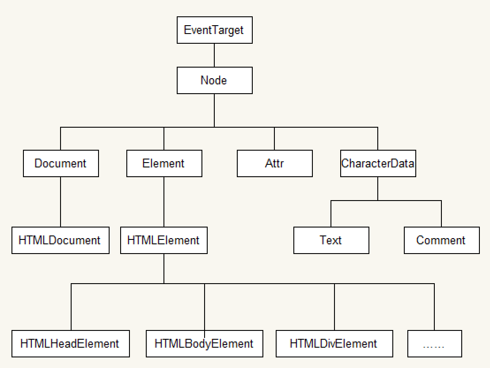

文档对象类型，定义了一组访问和操作文档（HTML和XML）的接口。 




## 1. 节点 

- 节点类型 

  - Element：一个文档中的元素。如<div>

  - Attribute: 元素的属性，如id

  - Text：元素的文本内容，不包括HTML代码

  - Comment：文档中的注释

  - Document：一个文档，既能表示HTML，也能表示XMLDocument

  - Type：文档类型，包括<DOCTYPE>元素中的内容

  - DocumentFragment：文档片段，在文档中并不存在的节点。

    作用，由于该节点可以包含许多类型的子节点，在文档中直接操作节点有时候会引起DOM树的重绘和重排，例如一下子插入大量的节点，势必会降低脚本的性能，而如果将要插入的节点先保存在文档片段中，把文档片段作为一个临时的节点仓库，然后在文档片段中对节点进行排版、加样式、改内容等操作，最后把整个文档片段插入到文档中，就能大大减少文档的重绘或重排次数，提升脚本性能。 

- 节点关系

  - parentNode：父亲节点
  - childNodes：孩子节点集合
  - firstNode：子节点中的第一个
  - lastNode：子节点中的最后一个
  - previousSibling：前一个兄弟节点
  - nextSibling：后一个兄弟节点 


## 2. Document

Document是DOM树的根节点。

- cookie：读取HTTP的cookie

- title：读取文档的标题

- domain：读取文档的域名，可以通过设置域名，放宽文档之间的同源限制

- lastModified：文档最新修改日期和时间

- location：和window一样，指向一个Location对象

- referrer：前一个文档的URL，其值和HTTP中请求的referer相同

- URL：文档的URL，即使通过Location对象修改了文档的URL，此属性值也不会变

- designMode：控制文档的可编辑性

- readyState：文档的加载状态

  ```js
  console.log(document.readyState); //loading
  document.addEventListener("DOMContentLoaded",function() {
      console.log(document.readyState); //interactive
  },false)
  window.onload = function () {
      console.log(document.readyState); //complete
  }
  ```

- doctype：文档类型 

  

## 3. Element 

- tagName：元素的标签名
- parentNode：过滤后的父节点（Element、Document、DocumentFragment中一种）
- children：子元素列表，只包含Element类型的节点
- childElementCount：子元素数量
- firstElementChild：第一个子元素
- lastElementChild：最后一个子元素
- previousElementSibling：前一个兄弟
- nextElementSibling：后一个兄弟 


## 4. 操作元素 

- 创建元素 

  ```js
  document.createElement('div')    // 创建一个具体的元素
  document.createTextNode() 		// 创建一个文本节点
  ```

- 插入元素 

  - appendChild() 

    ```js
    var dd = document.createElement("dd");
    var dl = document.getElementById('numbers');
    dd.innerHTML= 4;
    dl.appendChild(dd)
    ```

  - insertBefore() 

    ```js
    var dd = document.createElement("dd");
    var dl = document.getElementById('numbers');
    var third = document.getElementById('third')
    dd.innerHTML= 4;
    dl.insertBefore(dd,third)
    ```

- 查找 

  getElementById等方法与querySelector、querySelectorAll()的区别是实时和非实时，即后者在获取元素，当相同类型的元素插入文档时，获取的结果不会自动更新 

- 删除

  ```js
  container.removeChild(container.firstElementChild)
  ```

- 替换（某一个元素的子节点） 

  ```js
  var dd = document.createElement('dd');
  dd.innerHTML=4;
  dl.replaceChild(dd,dl.firstElementChild)
  ```

- 复制 

  ```js
  var shallow = container.cloneNode(),    //仅复制节点自身
  deep = container.cloneNode(true); 		//复制后代节点
  ```

- 读取文本 

  - textContent()能够将元素所有子节点的文本拼接起来 

- 检测

  - matchesSelector() ： 检测元素是否与指定的选择器匹配 

  - contains() ：检测传入的节点是否是当前节点的后代 

  - hasChildNodes() : 检测当前节点是否有子节点 

  - 添加某个类 

    ```js
    ele.classList.add('ui-border')
    ele.setAttribute('class',"ui-border");
    ele.className = "ui-border";
    ```

    


