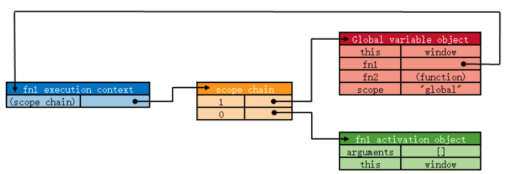

## 1. 词法作用域与动态作用域

作用域有两种形式：词法作用域和动态作用域

- 词法作用域：又称静态作用域， 在函数定义的时候函数作用域就确定好了，js采用**词法作用域**
- 动态作用域：在函数被调用的时候函数作用域才确定，动态作用域不会关心函数和作用域是怎么声明或者是在哪里声明，它只关心函数在哪里被调用 

```js
function foo() {
    console.log(a)
}
function bar() {
    var a = 2;
    foo();
}
var a = 1;
bar();
```

我们来简单分析一下上面的代码执行结果

- 假如JavaScript采用的是词法作用域的话，当执行bar函数的时候，先是声明了一个局部变量a，并将它赋值为2，然后执行foo函数 ，首先在foo函数内部查找有没有变量a，如果没有，则往上一层代码中查找，在foo函数外部声明了一个变量全局变量a，并且它别赋值为1，所以执行foo函数的结果是1。
- 假如JavaScript采用的是动态作用域的话，当执行到bar函数内部的foo函数时，也会先从foo函数内部查找有没有变量a，如果没有，则继续在调用foo函数的作用域里查找，所以最终会输出2。 


## 2. 作用域与作用域链

### 2.1 作用域

- 定义

  作用域是在运行时代码中的某些特定部分中变量，函数和对象的可访问性。换句话说，作用域决定了代码区块中变量和其他资源的可见性。

- 分类

  - 全局作用域 ：① 最外层函数和在最外层函数外面定义的变量拥有全局作用域 ②所有未定义直接赋值的变量自动声明为拥有全局作用域 ③所有window对象的属性拥有全局作用域 
  - 函数作用域：是指声明在函数内部的变量，和全局作用域相反，局部作用域一般只在固定的代码片段内可访问到，最常见的例如函数内部。 
  - 块级作用域：ES6 中开始加入了块级作用域，可通过新增命令let和const来体现，只在包含块{}中可以访问得到 

- 作用域是分层的，内层作用域可以访问外层作用域的变量，反之则不行 

### 2.2 作用域链

- 定义 

  函数对象中有一个内部属性是[[Scope]]，该内部属性包含了函数被创建的作用域中对象的集合，这个集合被称为函数的作用域链，它决定了哪些数据能被函数访问。

- 当一个函数创建后，它实际上保存一个作用域链，并且作用域链会被创建此函数的作用域中可访问的数据对象填充 

- 作用机制

  + 当某个函数第一次被调用时，就会创建一个执行环境/运行期上下文(execution context)，定义了函数执行的环境。
  + 每个运行期上下文都有自己的作用域链，用于标识符解析，当运行期上下文被创建时，而它的作用域链初始化为当前运行函数的[[Scope]]所包含的对象。
  + 这些值按照它们出现在函数中的顺序被复制到运行期上下文的作用域链中。它们共同组成了一个新的对象，叫“活动对象(activation object)”，该对象包含了函数的所有局部变量、命名参数、参数集合以及this
  + 然后此对象会被推入作用域链的前端（始终在作用域链的第0位），当运行期上下文被销毁，活动对象也随之销毁。 

  ```js
  var scope = "global";
  function fn1() {
      return scope;
  }
  fn1();
  ```



## 3. 执行上下文栈 

- 执行上下文的类型：共有三种类型 
  - 全局执行上下文：只有一个，浏览器中的全局对象就是 window 对象，this 指向这个全局对象 
  - 函数执行上下文：存在无数个，只有在函数被调用的时候才会被创建，**每次调用函数都会创建一个新的执行上下文。** 
  - Eval 函数执行上下文： 指的是运行在 eval 函数中的代码，很少用而且不建议使用。 
- 执行栈 
  - 执行栈，也叫调用栈，具有 LIFO（后进先出）结构，用于存储在代码执行期间创建的所有执行上下文。
  - 首次运行JS代码时，会创建一个全局执行上下文并Push到当前的执行栈中。每当发生函数调用，引擎都会为该函数创建一个新的函数执行上下文并Push到当前执行栈的栈顶。 
  -  根据执行栈LIFO规则，当栈顶函数运行完成后，其对应的函数执行上下文将会从执行栈中Pop出，上下文控制权将移到当前执行栈的下一个执行上下文。 


## 4. 闭包 

### 4.1 概念

闭包，官方对闭包的解释是：一个拥有许多变量和绑定了这些变量的环境的表达式（通常是一个函数），因而这些变量也是该表达式的一部分。闭包的特点： 

- 作为一个函数变量的一个引用，当函数返回时，其处于激活状态。 
- 一个闭包就是当一个函数返回时，一个没有释放资源的栈区。 

简单的说，Javascript允许使用内部函数——即函数定义和函数表达式位于另一个函数的函数体内。而且，这些内部函数可以访问它们所在的外部函数中声明的所有局部变量、参数和声明的其他内部函数。当其中一个这样的内部函数被包含它的外部函数之外的变量引用时，就会形成闭包。闭包就是能够读取其他函数内部变量的函数。 


### 4.2 生命周期 

- 闭包在嵌套内部函数定义执行完时就产生了。(不是调用)
- 闭包的个数等于包含函数的调用次数  


### 4.3 执行过程分析

```js
var a = 1;
function fn() {
    var b = 2;
    function fn1() {
        console.log(b);
    }
    fn1();
}
fn();
```

栈是一种先进后出的数据结构

1. 在执行fn前，此时我们在全局执行环境(浏览器就是window作用域)，全局作用域里有个变量a；
2. 进入fn，此时栈内存就会push一个fn的执行环境，这个环境里有变量b和函数对象fn1，这里可以访问自身执行环境和全局执行环境所定义的变量
3. 进入fn1，此时栈内存就会push 一个fn1的执行环境，这里面没有定义其他变量，但是我们可以访问到fn和全局执行环境里面的变量，因为程序在访问变量时，是向底层栈一个个找，如果找到全局执行环境里都没有对应变量，则程序抛出underfined的错误。
4. 随着fn1()执行完毕，fn1的执行环境被杯销毁，接着执行完fn()，fn的执行环境也会被销毁，只剩全局的执行环境下，现在没有b变量，和fn1函数对象了，只有a 和 fn(函数声明作用域是window下)在函数内访问某个变量是根据函数作用域链来判断变量是否存在的，而函数作用域链是程序根据函数所在的执行环境栈来初始化的，所以上面的例子，我们在fn1里面打印变量b，根据fn1的作用域链的找到对应fn执行环境下的变量b。
5. 所以当程序在调用某个函数时，做了一下的工作：**准备执行环境，初始函数作用域链和arguments参数对象** 

### 4.4 闭包的实现原理 

代码结构外层函数a和内部函数b，a的执行结果赋值给c。 

```js
function a(){
    let n = 1;
    let b = function() {
        return n++;
    }
    return b
}
let c = a()
```


- 当定义函数a的时候，js解释器会将函数a的作用域链(scope chain)设置为定义a时a所在的“环境”，如果a是一个全局函数，则scope chain中只有window对象。
- 当执行函数a的时候，a会进入相应的执行环境(excution context)。在创建执行环境的过程中，首先会为a添加一个scope属性，即a的作用域，其值就为第1步中的scope chain。即a.scope = a的作用域链。
- 然后执行环境会创建一个活动对象(call object)。活动对象也是一个拥有属性的对象，但它不具有原型而且不能通过JavaScript代码直接访问。
- 创建完活动对象后，把活动对象添加到a的作用域链的最顶端。此时a的作用域链包含了两个对象：a的活动对象和window对象。
- 下一步是在活动对象上添加一个arguments属性，它保存着调用函数a时所传递的参数。
- 最后把所有函数a的形参和内部的函数b的引用也添加到a的活动对象上。在这一步中，完成了函数b的的定义，因此函数b的作用域链被设置为b所被定义的环境，即a的作用域。
- 到此，整个函数a从定义到执行的步骤就完成了。此时a返回函数b的引用给c，又函数b的作用域链包含了对函数a的活动对象的引用，也就是说b可以访问到a中定义的所有变量和函数。函数b被c引用，函数b又依赖函数a，因此函数a在返回后不会被GC回收。当函数b执行的时候亦会像以上步骤一样。因此，执行时b的作用域链包含了3个对象：b的活动对象、a的活动对象和window对象 

概括一下：

因为变量的作用域是在创建的时候所建成的。所以当创建函数a的时候，会创建函数的作用域链，然后这个作用域链会赋值给a的scope属性。

当执行a函数的时候，会创建一个活动对象，这个活动对象包括arguments属性，函数a的形参和内部函数b的引用，并将活动对象调加到a的作用的最顶端。在这一步中，完成了函数b的的定义，函数b的作用域链被设置为b所被定义的环境，即a的作用域。此时a返回函数b的引用给c，函数b的作用域链包含了对函数a的活动对象的引用，也就是说b可以访问到a中定义的所有变量和函数。函数b被c引用，函数b又依赖函数a，因此函数a在返回后不会被GC回收。 

### 4.5 闭包的作用 

- 可以读取函数内部的变量 
- 让这些变量的值始终保持在内存中 


### 4.6 闭包的问题

- 由于闭包会使得函数中的变量都被保存在内存中，内存消耗很大，所以不能滥用闭包，否则会造成网页的性能问题，在IE中可能导致内存泄露。解决方法是，在退出函数之前，将不使用的局部变量全部删除。 
- 闭包会在父函数外部，改变父函数内部变量的值。所以，如果你把父函数当作对象（object）使用，把闭包当作它的公用方法（Public Method），把内部变量当作它的私有属性（private value），这时一定要小心，不要随便改变父函数内部变量的值 


### 4.7 例子

#### 4.7.1 解决for循环问题

下述代码都会输出6。因为setTimeout是个异步函数，会先把循环全部执行完毕。这是i=6; 

```js
for (var i = 1; i <= 5; i++) {
    setTimeout(function timer() {
    	console.log(i)
    }, i * 1000)
}
```

- 解决方案1，使用闭包 

  ```js
  for (var i = 1; i <= 5; i++) {
      ;(function(j) {
          setTimeout(function timer() {
     			console.log(j)
          }, j * 1000)
      })(i)
  }
  ```

- 解决方案2，setTimeOut的第三个参数，这个参数会被当成timer函数的参数传入 

  ```js
  for (var i = 1; i <= 5; i++) {
      setTimeout(
          function timer(j) {
          	console.log(j)
          }, i * 1000, i)
  }
  ```

- 解决方案3（用let定义） 

  ```js
  for (let i = 1; i <= 5; i++) {
      setTimeout(function timer() {
          console.log(i)
      }, i * 1000)
  }
  ```

  

#### 4.7.2 实际开发中的应用 

- 结果缓存 

  我们开发中会碰到很多情况，设想我们有一个处理过程很耗时的函数对象，每次调用都会花费很长时间，那么我们就需要将计算出来的值存储起来，当调用这个函数的时候，首先在缓存中查找，如果找不到，则进行计算，然后更新缓存并返回值，如果找到了，直接返回查找到的值即可。闭包正是可以做到这一点，因为它不会释放外部的引用，从而函数内部的值可以得以保留。 

- 模块

  一个js文件，将所有的数据和功能封装在一个函数内部 只向外暴露一个包含n个方法的对象或函数。通过使用闭包可以使得模块的数据在使用后依然保存在内存中。 

- 封装 

  ```js
  var person = function () {
  //变量作用域为函数内部，外部无法访问
      var name = "default";
      return {
          getName: function () {
              return name;
          },
          setName: function (newName) {
              name = newName;
          }
      }
  }();
  console.log(person.name); 		//直接访问，结果为undefined
  console.log(person.getName());	//default
  person.setName("summer");
  console.log(person.getName());	//summer
  ```

  

## 5. 内存溢出和内存泄漏 

- 介绍
  - 溢出：是指程序在申请内存时，没有足够的内存空间供其使用
  - 内存泄露：是指程序在申请内存后，无法释放已申请的内存空间，一次内存泄露危害可以忽略，但内存泄露堆积后果很严重，无论多少内存,迟早会被占光。最终可能造成内存溢出 
- 原因 
  - 全局变量引起的内存泄漏 
  - 闭包引起的内存泄漏 
  - dom清空或删除时，事件未清除导致的内存泄漏 
    - 子元素存在引用引起的内存泄漏： 
  - 被遗忘的计时器或回调函数 
- 预防
  - 减少不必要的全局变量，或者生命周期较长的对象，及时对无用的数据进行垃圾回收； 
  - 注意程序逻辑，避免“死循环”之类的 ； 
  - 避免创建过多的对象 原则：不用了的东西要及时归还。 

