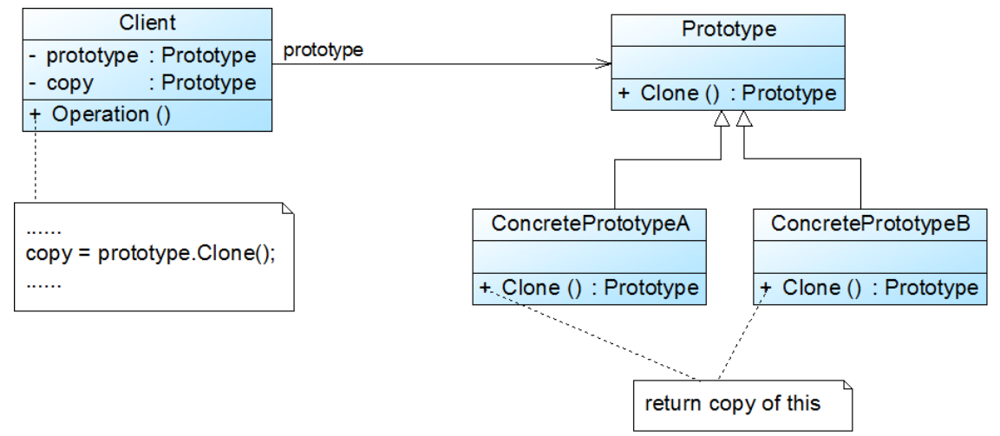
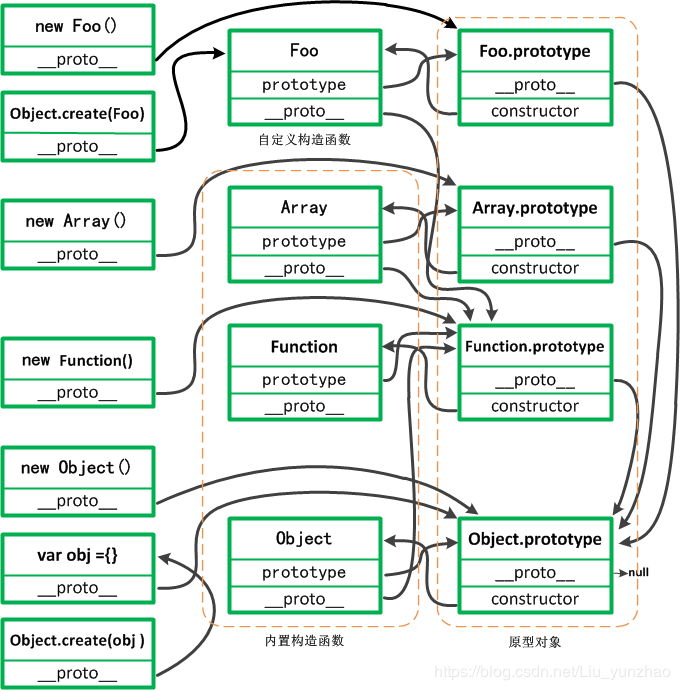

## 1. 原型设计模式

原型（Prototype）模式的定义如下：用一个已经创建的实例作为原型，通过复制该原型对象来创建一个和原型相同或相似的新对象。在这里，原型实例指定了要创建的对象的种类。用这种方式创建对象非常高效，根本无须知道对象创建的细节。 



1. Prototype(抽象原型类)：声明克隆方法的接口，是所有具体原型类的公共父类，它可是抽象类也可以是接口，甚至可以是具体实现类。
2. ConcretePrototype(具体原型类)：它实现抽象原型类中声明的克隆方法，在克隆方法中返回自己的一个克隆对象
3. Client(客户端)：在客户类中，让一个原型对象克隆自身从而创建一个新的对象。 


## 2. JS中的原型链 

对象之间通过原型关联到一起，就好比用一条链将一个个对象连接在一起，在与多个对象挂钩后，形成一条原型。当在某一个对象内部查找某个属性或方法时，会先在当前对象内部进行查找，没有的话就沿着原型链一级一级向上查找，找到则返回，直到达到原型链的顶端才停止搜索，原型链的顶端是**Object.prototype**。原型链是在创建的时候就确定的。

## 3. JS中的原型关系 

1. 所有的引用类型（数组、对象、函数），都具有对象特性，即可自由扩展属性；var arr = []; arr.a = 1; 

2. 所有的引用类型（数组、对象、函数），都有一个\_\_proto\_\_属性（隐式原型），属性值是一个普通的对象；

3. 所有的函数，都具有一个prototype（显式原型），属性值也是一个普通对象；

4. **所有的引用类型（数组、对象、函数），其隐式原型指向其构造函数的显式原型；**

   ```js
   obj.__proto__ === Object.prototype
   ```

5. 当试图得到一个对象的某个属性时，如果这个对象本身没有这个属性，那么会去它的\_\_proto\_\_（即它的构造函数的prototype）中去寻找；

6. **Object.prototype是原型链的尽头， 所有对象都可以通过\_\_proto\_\_找到它。**Object.prototype的隐式原型指向null。

   ```js
   Object.prototype.__proto__=== null
   ```

7. **Function.prototype是所有函数的原型链尽头，所有函数都可以通过\_\_proto\_\_找到它** 

8. **Object和Function都是构造函数，而所有的构造函数都是Function的实例对象** 

   ```js
   Object.__proto__  === Function.prototype = Function.__proto__
   Function.prototype.__proto__ === Object.prototype
   ```

9. 基本数据类型

   - Math, JSON的\__ptoto__是 Object.prototype

   - function test(){} 这样创建出来，没有继承关系的函数。

     `test.prototype.__proto__ === Object.prototype`

   - 对象字面量和new Object() 比如， var a ={}, b = new Object(), c = [];

     `a.__proto__ === a.constructor.prototype === Object.prototype`

   - 基本数据类型string,number,boolean, 比如 var a = '', b=10, c= false

     `b.__proto__ === b.constructor.prototype === Number.prototype`

     `b.__proto__.__proto__ === Number.prototype.__proto__ === Object.prototype`

   - null和undefined没有\__proto__



## 4. JS中的原型规则

- 原型中的所有的属性都是共享的。

  也就是说，用同一个构造函数创建的对象去访问原型中的属性的时候，大家都是访问的同一个对象，如果一个对象对原型的属性进行了修改，则会反映到所有的对象上面。 

- 构造函数中的属性和方法不共享。

  实例都有自己独有的一份，大家不会共享。这个特性对属性比较合适，但是对方法又不太合适。因为对所有对象来说，他们的方法应该是一份就够了，没有必要每人一份，造成内存的浪费和性能的低下。 

- 查找属性

  每个代码读取对象的某个属性时，都会执行一次搜索，目标是具有给定名字的属性。搜索首先从对象实例本身开始，如果有，则返回改属性。如果没有，则继续搜索指针指向的原型对象，在原型对象中查找具有给定名字的属性。 

- 实例与原型之间的连接是一个指针，而非一个副本。实例中的指针仅指向原型，而不指向构造函数。 

- 重写原型对象切断了现有原型和任何之前已经存在的对象实例之间的联系，它们引用的仍是最初的原型 


## 5. 与原型有关的属性和方法 

### 5.1 prototype属性

prototype 存在于构造函数中 (其实任意函数中都有，只是不是构造函数的时候prototype我们不关注而已) ，他指向了这个构造函数的原型对象。 

### 5.2 constructor属性

constructor属性存在于原型对象中，他指向了构造函数。`Person.prototype.constructor === Person`。但如果用字面量的方式重写原型对象，constructor不再指向构造函数，而是指向Object的构造函数。如果constructor很重要，应该在Person.prototype中添加一行这样的代码。`Person.prototype = { constructor : Person } `

### 5.3 _\_proto\_\_ 属性

用构造方法创建一个新的对象之后，这个对象中默认会有一个不可访问的属性 [[prototype]] , 这个属性就指向了构造方法的原型对象。`p1.__proto__ === Person.prototype `

### 5.4 hasOwnProperty()

判断一个属性是否来自对象本身 

### 5.5 in 操作符

判断一个属性是否存在于这个对象中。但是在查找这个属性时候，先在对象本身中找，如果对象找不到再去原型中找。换句话说，只要对象和原型中有一个地方存在这个属性，就返回true。 

`!obj.hasOwnProperty(name) && (name in obj)`可以判断原型中的属性是否存在 

### 5.6 Object.keys()

 获取对象上(不包括原型)所有可枚举的实例属性。Object.keys(Person.prototype) 

### 5.7 Object.getOwnPropertyNames()

获取对象上(不包括原型)所有(无论是否可枚举)的实例属性。`Object.getOwnPropertyNames(Person.prototype) `

### 5.8 instanceof

检测构造函数的prototype属性是否出现在某个实例对象的原型链上。 

A instanceof B

- 左操作数是一个普通的对象

- 右操作数是一个函数

  instanceof 回答的问题是：在 A 的整条 [[Prototype]] 链中是否有指向 B.prototype 的对象？

```js
var a = new Foo();
a instanceof Foo;	// true
```

缺陷：这个方法只能处理对象（a）和函数（带 .prototype 引用的 Foo）之间的关系。如果想判断两个对象（比如 a 和 b）之间是否通过 [[Prototype]] 链关联，只用 instanceof无法实现。

### 5.9 isPrototypeOf()

B.isPrototypeOf(A);

- A是一个对象

- B既可以是对象，也可以是函数

  B是函数时：B.prototype.isPrototypeOf(A);

isPrototypeOf(..) 回答的问题是：在 a 的整条 [[Prototype]] 链中是否出现过 B.prototype ？

```js
var a = new Foo();
Foo.prototype.isPrototypeOf(a); // true

var a = {};
var b = Object.create(a);
a.isPrototypeOf(b);
```


## 6. 实现继承的几种方式 

### 6.1 原型链继承 

- 核心：子类的构造函数的原型指向父类构造函数的实例

  ```js
  Child.prototype = new Parent()
  ```

- 优点

  - 非常纯粹的继承关系，实例是子类的实例，也是父类的实例 
  - 父类新增原型方法/原型属性，子类都能访问到 
  - 简单，易于实现 

- 缺点

  - 父类的**属性会被所有的实例共享**，这会导致对一个实例的修改会影响另一个实例。 

  - 在创建子类型的实例时，不能向超类型的构造函数中传递参数。 

    

### 6.2 构造函数继承 

- 核心：子类的构造函数内部调用父类构造函数

  ```js
  function Child() { 
      Parent.call(this)
  }
  ```

- 优点

  - 通过apply(),call()方法可以在（将来）新建对象上执行构造函数,即 在子类型对象上执行父类型函数中定义的所有对象初始化的代码。结果每个子类实例中都具有了父类型中的属性以及方法，解决了1中，子类实例共享父类引用属性的问题 。 
  - 创建子类实例时，可以向父类传递参数 

- 缺点

  - 实例并不是父类的实例，只是子类的实例 
  - 只能继承父类的实例属性和方法，不能继承父类原型属性/方法 
  - 无法实现函数复用，每个子类都有父类实例函数的副本，影响性能 


### 6.3 组合继承

- 核心：结合了两种模式的优点，传参和复用 

  ```js
  function Child() { 
      Parent.call(this)
  }
  Child.prototype = new Parent()
  ```

- 优点

  - 可以继承实例属性/方法，也可以继承原型属性/方法 
  - 既是子类的实例，也是父类的实例 
  - 不存在引用属性共享问题 
  -  通过call继承父类的基本属性和引用属性并保留能传参的优点 
  - 函数可复用 

- 缺点

  - 所有实例都会继承原型上的属性。 
  - 无法实现复用。（新实例属性都是后面添加的）
  - 实际上子类上会拥有超类的两份属性，只是子类的属性覆盖了超类的属性 


### 6.4 借用构造函数 + 深拷贝 

- 核心：子类的构造函数内部调用父类构造函数 + 对父类原型上的属性和方法进行深拷贝

  ```js
  function Child() {    
      Parent.call(this)
  }
  deepCopy(Student.prototype, Person.prototype);
  Student.prototype.constructor = Student; 
  ```

- 特点：子类实例所有属性和原型链的属性方法都不会共享 


### 6.5 寄生组合式继承（常用） 

- 核心

  ```js
  function Child() {
      Parent.call(this) // 生成子类的实例属性(但是不包括父对象的方法)
  }
  // 该方法会使用指定的原型对象及其属性去创建一个新的对象
  Child.prototype = Object.create(Parent.prototype)
  ```

- 优点

  - 该方法会使用指定的原型对象及其属性去创建一个新的对象
  - 会继承父类原型上的属性和方法，但不会继承父类实例上的方法
  - 所有子类独自拥有父类实例上的属性和方法，不会共享
  - 和原型继承相比，少了指向原型的实例这一层，所以属性就不会有两份 

### 6.6 ES6继承

类的所有方法都定义在类的 prototype 属性上，在类的实例上调用方法，其实就是调用原型上的方法。

实例的属性除非显式定义在其本身（即 this 对象) 上，否则都是定义在原型（即 Class ）上。

子类拥有自己以及父类的原型方法，并且子类的每个实例单独拥有，子类的原型对象是Parent的原型对象 

```js
class Parent {
    constructor(a) {
        this.value = a;				// 使用this将改属性定义在实例上
    }
    parentValue = 2;				// 定义在实例上
    parentFunc = function () {}		 // 定义在实例上
    toString () {}					// 没有使用this的都定义在原型上
}
class Child extends Parent {
    constructor(a, b) {
        super(a);
        this.selfValue2 = b;		 // 定义在实例上
    }
    selfValue = 1;					// 定义在实例上
    selfFunc = function () {}		 // 定义在实例上
}
let p = new Parent(6)
let c1 = new Child(11, 12);
let c2 = new Child(11, 12);
console.log(p.hasOwnProperty('parentFunc'));		// true
console.log(p.hasOwnProperty('toString'));			// false
console.log(c1); // Child {parentValue: 2, value: 11, selfValue: 1, selfValue2: 12, selfFunc: ƒ}
console.log(c1.__proto__.value);					// undefined
console.log(c1.parentFunc === c2.parentFunc); 		 //false
console.log(c1.toString === c2.toString); 			// true
```


