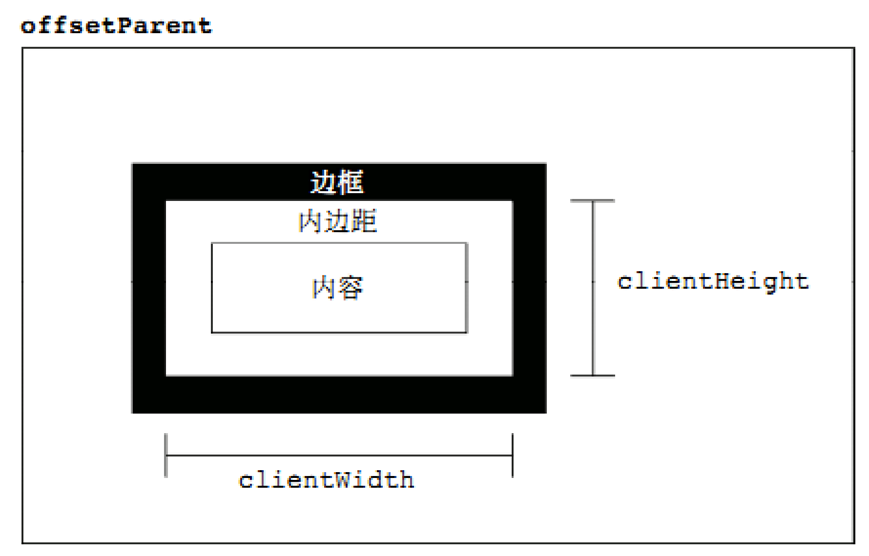

## 1. 元素宽高

1. offsetWidth       // 元素的宽度（包括元素宽度、内边距和边框，不包括外边距）   border-box
2. offsetHeight      // 元素的高度（包括元素高度、内边距和边框，不包括外边距）   border-box
3. clientWidth        // 元素的宽度（包括元素宽度、内边距，不包括边框和外边距）  padding-box
4. clientHeight       // 元素的高度（包括元素高度、内边距，不包括边框和外边距）  padding-box
5. style.width         // 元素的宽度（包括元素宽度，不包括内边距、边框和外边距）   content-box
6. style.height       // 元素的高度（包括元素高度，不包括内边距、边框和外边距）    content-box
7. scrollWidth       // 元素的宽度(包括滚动条区域未显示的)（包括元素宽度、内边距和溢出尺寸，不包括边框和外边距），无溢出的情况，与clientWidth相同   padding-box(含溢出)
8. scrollHeigh       // 元素的高度(包括滚动条区域未显示的)（包括元素高度、内边距和溢出尺寸，不包括边框和外边距），无溢出的情况，与clientHeight相同  padding-box(含溢出)
9. window.innerWidth  // 浏览器窗口的视口宽度
10. window.outerWidth  // 浏览器窗口的宽度
11. document.documentElement.clientWidth || document.body.clientWidth （浏览器视口宽度的兼容写法）

> 注意：当行内元素调用clientWidth 、clientHeight 时，返回结果都为0 

## 2. 元素距离

1. offsetTop    // 元素的上外缘距离最近采用定位父元素内壁的距离，如果父元素中没有采用定位的，则是获取上外边缘距离文档内壁的距离。所谓的定位就是position属性值为relative、absolute或者fixed。返回值是一个整数，单位是像素。此属性是只读的。

2. offsetLeft       // 此属性和offsetTop的原理是一样的，只不过方位不同。

3. clientTop       //  元素上边框(border-top)的宽度

4. clientLeft       //  元素左边框(border-left)的宽度

5. offsetParent  // 元素距离最近的定位父元素

## 3. 滚动条

1. window.pageXOffset：滚动条到视口左边的距离
2. window.pageYOffset：滚动条到视口上边的距离
3. document.documentElement.scrollTop|| document.body.scrollTop （滚动条到视口上边距的兼容写法）
4. scrollTop       // 获取或者设置对象的最顶部到对象在当前窗口显示的范围内的顶边的距离，也就是元素滚动条被向下拉动的距离。返回值是一个整数，单位是像素。此属性是可读写的。 
5. scrollLeft        // 获取或者设置对象的最左边到对象在当前窗口显示的范围内的左边的距离，也就是元素被滚动条向左拉动的距离。返回值是一个整数，单位是像素。此属性是可读写的。

## 4. 鼠标事件的距离

1. clientX        鼠标相对于浏览器（浏览器的有效区域）左上角x轴的坐标；  不随滚动条滚动而改变；
2. clientY        鼠标相对于浏览器（浏览器的有效区域）左上角y轴的坐标；  不随滚动条滚动而改变；
3. pageX        鼠标相对于浏览器（浏览器的有效区域）左上角x轴的坐标；  随滚动条滚动而改变；
4. pageY        鼠标相对于浏览器（浏览器的有效区域）左上角y轴的坐标；  随滚动条滚动而改变；
5. screenX     鼠标相对于显示器屏幕左上角x轴的坐标； 
6.  screenY      鼠标相对于显示器屏幕左上角y轴的坐标；  
7. offsetX        鼠标相对于事件源左上角X轴的坐标
8. offsetY        鼠标相对于事件源左上角Y轴的坐标 

## 5. jQuery方法获取元素的宽度 

|         | 内容 | 内边距 | 边框 |
| :-----: | :--: | :----: | :--: |
| width() |  √   |   ×    |  ×   |
|         |      |        |      |
|         |      |        |      |

