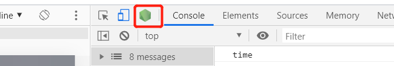
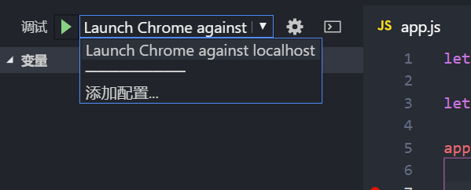

# 简介

##  1. 简介

* Node.js是一个JavaScript运行时环境，可以解析和执行JS代码（以前JS只能依赖于浏览器执行），它让JS运行在服务器端，可以与PHP、JSP、Python、Ruby平起平坐。
* Node.js没有BOM和DOM，只有ECMAScript和服务器级别的API。
* V8引擎本身就是用于Chrome浏览器的JS解释部分，但是Ryan Dahl这哥们，鬼才般的，把这个V8搬到了服务器上，用于做服务器的软件。
* Node.js是一个专注于实现**高性能Web服务器优化**的专家，几经探索，几经挫折后，遇到V8而诞生的项目。

但Node似乎有点不同：

*  Node.js不是一种独立的语言，与PHP、JSP、Python、Perl、Ruby的“既是语言，也是平台”不同，Node.js的使用JavaScript进行编程，**运行在JavaScript引擎上（V8）**。
*  与PHP、JSP等相比（PHP、JSP、.net都需要运行在服务器程序上，Apache、Naginx、Tomcat、IIS。），Node.js跳过了Apache、Naginx、IIS等HTTP服务器，它自己不用建设在任何服务器软件之上。Node.js的许多设计理念与经典架构（LAMP = Linux + Apache + MySQL + PHP）有着很大的不同，可以提供强大的伸缩能力。一会儿我们就将看到，**Node.js没有web容器**。
*  Node.js自身哲学，是花最小的硬件成本，追求更高的并发，更高的处理性能。

官网：https://nodejs.org/en/
特点：Node.js uses an event-driven, non-blocking I/O model that makes it lightweight and efficient. 

## 2 特点

所谓的特点，就是Node.js是如何解决服务器高性能瓶颈问题的。

### 2.1 单线程

在Java、PHP或者.net等服务器端语言中，会为每一个客户端连接创建一个新的线程。而每个线程需要耗费大约2MB内存。也就是说，理论上，一个8GB内存的服务器可以同时连接的最大用户数为4000个左右。要让Web应用程序支持更多的用户，就需要增加服务器的数量，而Web应用程序的硬件成本当然就上升了。

Node.js不为每个客户连接创建一个新的线程，而仅仅使用一个线程。当有用户连接了，就触发一个内部事件，通过非阻塞I/O、事件驱动机制，让Node.js程序宏观上也是并行的。使用Node.js，一个8GB内存的服务器，可以同时处理超过4万用户的连接。

* 好处，还有操作系统完全不再有线程创建、销毁的时间开销。
* 坏处，就是一个用户造成了线程的崩溃，整个服务都崩溃了，其他人也崩溃了。

### 2.2 非阻塞I/O

例如，当在访问数据库取得数据的时候，需要一段时间。在传统的单线程处理机制中，在执行了访问数据库代码之后，整个线程都将暂停下来，等待数据库返回结果，才能执行后面的代码。**也就是说，I/O阻塞了代码的执行，极大地降低了程序的执行效率。**

由于Node.js中采用了非阻塞型I/O机制，因此在执行了访问数据库的代码之后，将立即转而执行其后面的代码，把数据库返回结果的处理代码放在回调函数中，从而提高了程序的执行效率。

当某个I/O执行完毕时，将以事件的形式通知执行I/O操作的线程，线程执行这个事件的回调函数。为了处理异步I/O，线程必须有事件循环，不断的检查有没有未处理的事件，依次予以处理。

阻塞模式下，一个线程只能处理一项任务，要想提高吞吐量必须通过多线程。**而非阻塞模式下，一个线程永远在执行计算操作，这个线程的CPU核心利用率永远是100%。所以，这是一种特别有哲理的解决方案：与其人多，但是好多人闲着；还不如一个人玩命，往死里干活儿。**

### 2.3 事件驱动

在Node中，客户端请求建立连接，提交数据等行为，会触发相应的事件。在Node中，在一个时刻，只能执行一个事件回调函数，但是在执行一个事件回调函数的中途，可以转而处理其他事件（比如，又有新用户连接了），然后返回继续执行原事件的回调函数，这种处理机制，称为“事件环”机制。

Node.js底层是C++（V8也是C++写的）。**底层代码中，近半数都用于事件队列、回调函数队列的构建。**用事件驱动来完成服务器的任务调度，这是鬼才才能想到的。针尖上的舞蹈，用一个线程，担负起了处理非常多的任务的使命。


说是三个特点，实际上是一个特点，离开谁都不行，都玩儿不转了。

Node.js很像抠门的餐厅老板，只聘请1个服务员，服务很多人。结果，比很多服务员效率还高。

Node.js中所有的I/O都是异步的，回调函数，套回调函数。

## 3 适合开发什么？

Node.js适合用来开发什么样的应用程序呢？

善于I/O，不善于计算。因为Node.js最擅长的就是任务调度，如果你的业务有很多的CPU计算，实际上也相当于这个计算阻塞了这个单线程，就不适合Node开发。

**当应用程序需要处理大量并发的I/O，而在向客户端发出响应之前，应用程序内部并不需要进行非常复杂的处理的时候，Node.js非常适合。Node.js也非常适合与web socket配合，开发长连接的实时交互应用程序。**

比如：

● 用户表单收集

● 考试系统

● 聊天室

● 图文直播

● 提供JSON的API（为前台Angular使用）

## 4 无法挑战老牌3P


## 5 学习资源推荐

- 《深入浅出Node.js》
- 《Node.js权威指南》
- JavaScript标准参考教程：<http://javascript.ruanyifeng.com/> 
- Node入门：<https://www.nodebeginner.org/index-zh-cn.html> 
- 官方API文档：<https://nodejs.org/zh-cn/docs/> 
- 中文文档（版本比较旧）：<http://nodeclass.com/api/node.html> 
- CNODE社区：<https://cnodejs.org/> 
- CNODE-新手社区：<https://cnodejs.org/getstart> 

# 模块

- 在 Node 中没有全局作用域的概念, 只能通过 require 方法来加载执行多个 JavaScript 脚本文件。

- require 加载只能是执行其中的代码，文件与文件之间由于是模块作用域，所以不会有污染的问题

  - 模块完全是封闭的
  - 外部无法访问内部
  - 内部也无法访问外部

- 模块作用域固然带来了一些好处，可以加载执行多个文件，可以完全避免变量命名冲突污染的问题。但是某些情况下，模块与模块是需要进行通信的，在每个模块中，都提供了一个对象：`exports`，该对象默认是一个**空对象**，你要做的就是把需要被外部访问使用的成员手动的挂载到 `exports` 接口对象中，然后谁来 `require` 这个模块，谁就可以得到模块内部的 `exports` 接口对象

  ```js
  // 模块引用的简单例子
  // a.js
  var person = require('./b.js')
  console.log(person.age)
  console.log(person.add(1,2));
  
  // b.js
  exports.age = 20;
  exports.add = function (a, b) {
      return a+b
  }
  ```

  

## 1. 系统模块

- 需要require()，但不需要单独下载的模块
- path ：用于处理文件路径和目录路径的实用工具
- fs：用于文件读写操作

## 2. 自定义模块

### 2.1 导出模块`exports` 

- Node中是模块作用域，默认文件中所有成员只有在当前文件模块有效 
- 对于希望可以被其它模块访问的成员，我们就需要把这些公开的成员都挂载到`exports`接口对象中。 

导出多个成员（必须在对象中）

```js
exports.a = 123
exports.b = 'hello'
exports.c = function () {
    console.log('lala')
}
exports.d = {
    foo: 'bar'
}

```

导出单个成员（拿到的就是函数、字符串、对象等） 

```js
module.exports = 'hello'
```

以下情况会覆盖 

```js
module.exports = 'hello'
// 后者覆盖前者
module.exports = function (x, y) {
    return x + y
}
```

也可以导出多个成员 

```js
module.exports = {
    add: function (x, y) {
        return x + y
    }
    str: 'hello'
}
```

### 2.2 导入模块 `require` 

```js
let module1 = require（'xxx'）
```

- 第三方模块：xxx为模块名
- 自定义模块：xxx为模块文件路径
- 第三方模块需要放在自定义模块上方

### 2.3 查找规则

以require('art-template')为例：

1. 首先查找当前目录下的：node_modules/art-template
2. 存在则继续查找：node_modules/art-template/package.json
3. 查看 node_modules/art-template/package.json mian中的入口文件。默认执行index.js
4. 如果1中没有查找到，会进入上一级目录查找node_modules。
5. 按照这个规则依次往上一级目录查找，如果在磁盘根目录还找不到，则报错。

### 2.4 特点

优先从缓存加载 

```js 
// main.js
let moduleA = require('./a.js')
// 由于a.js已经从加载过b模块，所以这次请求会直接从缓存中读取，所以只会输出一次'b被加载了'
let moduleB = require('./b.js')
console.log(moduleB)
```

```js 
// a.js
console.log('a被加载了')
let moduleB = require('./b.js')
console.log(moduleB)
```

```js 
// b.js
console.log('b被加载了')
module.exports = function () {
    console.log('b 模块');
}
```

``` 
// 输出
a被加载了
b被加载了
[Function]
[Function]
```

## 3. 核心模块

Node为JS提供了很多服务器级别的API，这些大多数都被包装到一个具名的核心模块中。例如文件操作的`fs`模块，http服务器构建的`http`模块，`path`路径操作模块，`os`操作系统模块

### 3.1 HTTP模块

#### 3.1.1 基本的代码

```js
// 这个案例简单讲解http模块
// 引用http模块
var http = require("http");
// 创建一个服务器，回调函数表示接收到请求之后做的事情
var server = http.createServer(function(req,res){
    // req参数表示请求，res表示响应
    console.log("服务器接收到了请求" + req.url);
    res.end();
});
// 监听端口
server.listen(3000, "127.0.0.1");
```

#### 3.1.2 设置一个响应头 

- 服务器最好把每次响应的数据是什么内容类型都告诉客户端，而且要正确的告诉
- 不同的资源对应的 Content-Type 是不一样，具体参照：http://tool.oschina.net/commons
- 对于文本类型的数据，最好都加上编码，目的是为了防止中文解析乱码问题
- 常见的类型 
  - image/jpeg ：图片类型
  - text/html: 网页类型
  - text/plain: 普通文本类型
  - text/css : css文件类型
  - application/x-javascript ：js文件类型

```js
// 一般字符类型的需要加编码类型
res.writeHead(200, {"Content-Type":"text/html;charset=UTF8"}); 
```


### 3.2 FS模块

#### 3.2.1 读取文件

```js
var fs = require('fs')
fs.readFile('./data/hello.txt',(err,data)=>{
    if (err) {
        throw err
    }
    console.log(data.toString())
    
})
```

#### 3.2.2 写文件

```js
fs.writeFile('./data/write.txt','我是写入的内容', (err)=>{
    if (err) {
        throw err
    }
    console.log('文件写入成功')
})
```


### 3.3 URL模块

req中最关键的就是req.url属性，表示用户的请求URL地址。所有的路由设计，都是通过req.url来实现的。我们比较关心的不是拿到URL，而是识别这个URL。

**识别URL，用到两个新模块，第一个就是url模块，第二个就是querystring模块**

字符串查询，用querystring处理 

```js
1	querystring.parse('foo=bar&baz=qux&baz=quux&corge')
2	// returns
3	{ foo: 'bar', baz: ['qux', 'quux'], corge: '' }
4	
5	// Suppose gbkDecodeURIComponent function already exists,
6	// it can decode `gbk` encoding string
7	querystring.parse('w=%D6%D0%CE%C4&foo=bar', null, null,
8	  { decodeURIComponent: gbkDecodeURIComponent })
9	// returns
10	{ w: '中文', foo: 'bar' }

```


### 3.4 Path模块

文件操作路径中相对路径设计的就是相对于node执行时所处的文件目录

```powershell
D:\web>node js/hello.js
```

此时，hello.js文件中相对路径是相对于web文件夹

所以应该用`__dirname`进行拼接。`__dirname`是文件所处的绝对路径

使用 path.join(__dirname , './a.txt') 进行拼接

- `__dirname`动态获取可以用来获取当前文件模块所属目录的绝对路径
- `__filename`动态获取可以用来获取当前文件的绝对路径
- `__dirname`和`__filename`是不受执行node命令所属路径影响的


# express

## 1. 安装

装包：`npm install express --save`

## 2. get

```js
// 当服务器收到get请求 / 的时候。执行回调函数
app.get('/', function (req, res) {
    res.send('hello express!')
})
```

## 3. post

解析post方式传递的参数需要借助一个第三方插件，叫body-parser 

1. 安装：`npm i --save body-parser `

2. 配置

   ```js
   const express = require('express')
   const bodyParser = require('body-parser')
   
   var app = express()
   
   // parse application/x-www-form-urlencoded
   app.use(bodyParser.urlencoded({ extended: false }))
   
   // parse application/json
   app.use(bodyParser.json())
   
   app.use(function (req, res) {
     res.setHeader('Content-Type', 'text/plain')
     res.write('you posted:\n')
     res.end(JSON.stringify(req.body, null, 2))
   })
   ```

   

```js
// 当以post方法请求 /submit 的时候，指定对应的处理函数
app.post('/submit', function (req, res) {
    res.send('post request')
})
```

## 4. 开放静态资源

```js

// 公开指定目录 这样就可以直接使用public文件目录下的所有资源
// /public/js/modeule1.js
app.use('/public/', express.static('./public/'))
// 当use省略第一个参数时，表明资源请求的请求路径不加/public/，直接以之后的目录开头
// /js/modeule1.js
app.use(express.static('./public/'))

```


## 5.在express中使用art-template

1. 安装

   ```js
   // express-art-template 是专门用来在 Express 中把 art-template 整合到 Express 中
   //  express-art-template 依赖了 art-template
   npm insatll --save art-template
   npm insatll --save express-art-template
   ```

2. 配置

   ```js
   // 第一个参数用来配置视图的后缀名，当渲染以 .html 结尾的文件的时候，使用 art-template 模板引擎
   app.engine('html', require('express-art-template'))
   // express-art-template默认以views为相对路径，也可以通过以下的方式配置
   app.set('views', path.join(__dirname, './views/'))
   ```

3. 使用

   ```js
   app.get('/', (req, res) => {
       // express默认会去项目中的views目录找index.html
       res.render('index.html', {
           title: 'hello'
       })
   })
   ```

   

## 6. 路由

把所有的路由写在router.js中

1. 创建路由（router.js）

   ```js
   const express = require('express')
   let router = express.Router()
   ```

2. 把路由怪哉到router容器中 （router.js）

   ```js
   router.get('/', (req, res) => {
       res.render('index.html')
   })
   ```

3. 导出路由（router.js）

   ```js
   module.exports = router
   ```

4. app中挂载路由容器 （app.js)

   ```js
   let router = require('./router.js')
   app.use(router)
   ```

   

## 7. 返回客户端

- 以字符串渲染页面

  ```js
  res.send('hello')
  ```

- 返回html页面

  ```js
  res.render('index.html')
  ```

- 返回http状态码以及数据

  ```js
  res.status(500).json({
      err_code: 500,
      message: err.message
  })
  ```

## 8. express-session

在express中默认不支持 Session 和 Cookie ，但是可以使用第三方中间件`express-session`来解决

> 默认Session数据是内存存储的，服务器一旦重启session就会丢失，真正开发环境会把session进行持久化存储。

1. 安装

   ```powershell
   npm install express-session
   ```

2. 配置

   ```js
   app.use(session({
       // 配置加密字符串，它会在原有加密的基础上和这个字符串拼接起来加密
       // 目的是为了增加安全性，防止客户端恶意伪造
       secret: 'keyboard cat', 
       resave: false,
       // 无论是否使用Session，都会默认直接给你分配一把钥匙
       // 改成false会在真正往session存数据时才会分配钥匙
       saveUninitialized: true
   }))
   
   ```

3. 使用

   ```js
   // 添加Session数据
   req.session.foo = 'bar'
   
   // 获取Session数据
   req.session.foo
   ```

   

## 7. 基本的代码

```js
let express = require('express')

// 创建服务器应用程序 等效于http.createServer
let app = express()

app.get('/', function (req, res) {
    res.send('hello express!')
})

// 相当于server.listen
app.listen(3000, function (){
    console.log('running...')
})
```


# MongoDB数据库

利用mongoose在Node.js中连接并操作MongoDB数据库

## 1. 安装

```shell
npm install --save mongoose
```

## 2. 打开MongoDB数据库

```powershell
// 启动服务器
D:\>mongod 

// 重新打开一个终端，连接数据库
D:\>mongo.exe  或者 D:\>mongo
```

## 3. 示例代码

```js
const mongoose = require('mongoose');
// 连接 MongoDB 数据库, test不存在会在插入第一条数据后自动被创建
mongoose.connect('mongodb://localhost/test');
// 创建一个模型，就是设计数据库， 表名为Cat
const Cat = mongoose.model('Cat', { name: String });
// 实例化一个Cat
const kitty = new Cat({ name: 'Zildjian' });
// 持久化保存kitty实例
kitty.save().then(() => console.log('meow'));
```

## 4. 官方指南

### 4.1 连接数据库

```js
const mongoose = require('mongoose')
// 1. 连接数据库，test不存在会在插入第一条数据后自动被创建
mongoose.connect('mongodb://localhost/test')

// connection是mongoose模块的默认引用，返回一个Connetion对象。因为connect()方法并不能监听数据库连接情况，所以，一般情况下此方法跟connet()方法搭配使用
const db = mongoose.connection;//获取connection实例
//使用Connetion监听连接状态
db.on('connected',function(err){
    if(err){
        console.log('连接数据库失败：'+err);
    }else{
        console.log('连接数据库成功！');
    }
});
```


### 4.2 设计Scheme发布Model

```js
/**
 * 设计文档结构，字段名称就是表结构的属性名称
 * 约束的目的是为了保证数据的完整性，不要有脏数据
 */
let Schema = mongoose.Schema
var userSchema = new Schema({
    name: {
        type: String,
        require: true
    },
    password: {
        type: String,
        required: true
    },
    phone: {
        type: String,
    }
})

/**
 * 将文档结构发布为模型， mongoose.model用来将一个架构发布为model
 * 参数1：传入一个大写名词单数字符用来表示你的数据库名称，
 * mongoose会自动将大写名词的字符串生成小写复数的集合名称
 * 参数2：架构
 * 返回值：模型构造函数
 */
let User = mongoose.model('User', userSchema)
```

### 4.2 增加数据

```js
// 使用构造函数
let admin = new User({
    username: 'admin',
    password: '1234',
    phone: '145216256115'
})
// 保存数据
admin.save().then(() => console.log('插入成功')).catch((err) => {throw err})
```

### 4.3 查询

- 查询所有

  ```js
  User.find((err, ret) => {
      if(err) {
          console.log('查询失败');
      }else{
          console.log(ret);
      }
  })
  
  // 另一种写法
  User.find().then((ret) => console.log(ret)).catch((err) => {throw err})
  ```

- 按条件查询所有

  ```js
  User.find({'username':'admin2'}, (err, ret) => {
      if(err) {
          console.log('查询失败');
      }else{
          console.log(ret);
      }
  })
  // 如要查询阅读量大于300小于400的文章
  Article.find({views : {$gte : 300 , $lte : 400}})
  //  正则查询
  User.find({'user':{$regex:/w/g}}, function(err, res){
      if (err) {
          console.log("Error:" + err);
      }
      else {
          console.log("Res:" + res);
      }
  })
  
  // 或查询
   User.findOne({
       $or: [{
           email: req.body.email
       }, {
           nickname: req.body.nickname
       }]
   }，(err, ret) => {
      if(err) {
          console.log('查询失败');
      }else{
          console.log(ret);
      }
  }）
  
  
  
  ```

- findOne

  ```js
  User.findOne({'username':'admin2'}, (err, ret) => {
      if(err) {
          console.log('查询失败');
      }else{
          console.log(ret);
      }
  })
  ```

- findById

  ```js
  var id = '11111111aa359cb73';
  User.findById(id, function(err, res){
      if (err) {
          console.log("Error:" + err);
      }
      else {
          console.log("Res:" + res);
      }
  })
  ```

  

### 4.4 删除

- remove

  ```js
  User.remove({'password':'1234'}, (err, ret) => {
       if (err) return handleError(err)
  })
  ```

- findOneAndRemove 

  ```js
  Model.findOneAndRemove(conditions, [callback])
  ```

  

### 4.5 更新

* findByIdAndUpdate

  ```js
  User.findByIdAndUpdate('5e4d37bbb69129210416a017', {password: '232323'}, function (err, ret) {
      if (err) return handleError(err);
      console.log(ret)
  });
  ```

* update

  ```js
  User.update({'user' : 'ws'}, {'password': '123'}, function(err, res){
      if (err) return handleError(err);
      console.log(res);
  })
  ```

* findOneAndUpdate

  ```js
  Model.findOneAndUpdate(conditions, update, [options], [callback])
  ```

  

# 配置/调试

## 1. 修改完自动重启

使用第三方工具：`nodemon`来帮助解决频繁修改代码重启服务器问题

`nodemon`是一个基于Node.js开发的一个第三方命令行工具，使用的时候需要独立安装

```shell
npm install -g nodemon
```

安装完毕之后使用 `nodemon app.js` 替换原来的` node app.js`命令启动代码。

这样可以监视文件变化，帮助自动重启服务器

## 2. 使用Inspector调试

需要在vscode中打开auto attach

vscode 左下角 锯齿 的设置按钮 -> 点击设置 -> 搜索setting.json文件 -> 添加`"debug.node.autoAttach": "on" `

### 2.1 Chrome

1. 方法一：访问chrome://inspect，点击配置按钮，确保Host和Port的正确

   - `node --inspect .\app.js`启动js文件
   - 打开`chrome://inspect`
   - 配置IP和port
   - 点击inspect

2. 方法二：访问元信息中的 devtoolsFrontendUrl

   - 查看元信息：<http://localhost:9229/json> 
   - 进入devtoolsFrontendUrl 的地址

3. 点击绿色小按钮

   控制台会出现这个绿色的小图标，点击就会弹出调试窗口

   

### 2.2 VS code

1. 方法一：

   `node --inspect .\app.js`启动js文件

2. 方法二：

   F5

3. 方法三：

   配置launch.json，添加配置

   

   

# 案例

## 1. 页面显示文件夹内容

- 功能
  - 显示本地某个文件夹下的文件列表
- 涉及到的点
  - 如何读取文件夹的文件列表？
    - 读取文件夹：`fs.readdir(路径, callback)`
  - 如何将读取的信息以指定样式渲染到页面上？
    - 先写一个html模板
    - 读取此html文件
    - 利用字符串替换或模板引擎的方式，将数据写入到html模板中
    - 将修改后的html文件写入到页面

### 1.1 字符串替换

```js
/**
* 主要思路：
* 1. 读取html模板文件，然后将li区域的代码以一个字符替换
* 2. 读取文件夹中的文件，然后用li的代码进行字符串拼接
* 3. 将模板的中读出的数据转为字符串，然后对1中设定的字符替换成2中拼接的字符串
* 4. 将数据显示到页面上
*/
let http = require('http')
let fs = require('fs')

http.createServer((req, res) => {
    let basePath = 'E:/test'
    // 1. 读取模板页面
    fs.readFile('./template.html', (err,data) => {
        if (err) {
            throw err
        }
        // 2. 读取当前路径下的的所有文件列表
        let content = ''
        fs.readdir(basePath, (err, files) => {
            if (err) {
                throw err
            }
            // 3. 生成需要替换的内容
            content = ''
            files.forEach((item) => {
                content += 
                `<tr>
                    <td data-value="apple/">
                    <a class="icon dir" href="/D:/Movie/www/apple/">${item}/</a>
                    </td>
                    <td class="detailsColumn" data-value="0"></td>
                    <td class="detailsColumn" data-value="1509589967">2017/11/2 上午10:32:47</td>
                </tr>`
            })
            // 4. 替换
             data = data.toString()
             data = data.replace('^_^', content)
             res.end(data)
        });
       
    })
}).listen(3000, () => {
    console.log('running')
})
```

### 1.2 模板引擎渲染

- 采用`art-template`模板引擎，首先npm art-template这个包

```js
// 利用模板引擎的方式 
let http = require('http')
let fs = require('fs')
let artTemplate = require('art-template')

http.createServer((req, res) => {
    let basePath = 'E:/test'
    // 1. 读取模板页面
    fs.readFile('./template2.html', (err, data) => {
        if (err) {
            throw err
        }
        // 2. 读取文件夹的内容
        fs.readdir(basePath, (err, files) => {
            if (err) {
                throw err
            }
            // 3. 模板渲染
            let ret = artTemplate.render(data.toString(), {
                title: basePath,
                files
            })
            // 4. 渲染到浏览器
            res.end(ret)
        });

    })
}).listen(3000, () => {
    console.log('running')
})
```

```html
// 模板引擎对于的html
...
<tbody id="tbody">
    {{each files}}
    <tr>
        <td data-value="apple/"><a class="icon dir" href="/D:/Movie/www/apple/">{{$value}}/</a></td>
        <td class="detailsColumn" data-value="0"></td>
        <td class="detailsColumn" data-value="1509589967">2017/11/2 上午10:32:47</td>
    </tr>
    {{/each}}
</tbody>
...

```

## 2. 评论列表及发表

- 功能

  - 包含两个页面`index.html`和`post.html`。
    - `index.html`：为已发表的评论列表页面
    - `post.html`：为发表评论的表单页面
  - 用户在`index.html`的页面中点击去评论可以跳到`post.html`页面
  - 在`post.html`页面中填完表单会发送到后台，成功后跳转到`index.html`

- 思路

  - 读取`index.html`
  - 使用模板引擎渲染数据（数据不涉及到数据库，是在node中定义的）
  - 匹配表单提交的路径，将接收到存到评论列表的数组中
  - 在`post.html`利form表单的action方法进行数据提交
  - 让表单重定向到首页

- 要点

  - 读取`index.html`和`post.html`时，其包含的静态资源无法正常获取？

    - 因为在node中读取这两个页面时，相对路径发生了变化。所以应该把静态资源单独放到`public`文件夹中，这两个页面的所有静态资源以`/public`开头，然后在node中设置所有以`/public`开头的`pathname`，读取`'.' + pathname `路径下的资源。

  - 如何让表单重定向到首页

    - node中处理完提交的数据后，返回给浏览器的数据中，状态码设置为302，以及在响应头中通过 Location 告诉客户端往哪儿重定向 

      `res.writeHead(302, {'Location': '/'}) `


### 2.1 原生node的方式 

```js
var http = require('http')
var fs = require('fs')
var url = require('url')
var template = require('art-template')

var comments = [
  {
    name: '张三',
    message: '今天天气不错！',
    dateTime: '2015-10-16'
  }
]

http.createServer(function (req, res) { 
    var parseObj = url.parse(req.url, true)
    var pathname = parseObj.pathname // 获取请求的路径，不包括请求的参数
    if (pathname === '/') {
      fs.readFile('./views/index.html', function (err, data) {
        if (err) {
          return res.end('404 Not Found.')
        }
        var htmlStr = template.render(data.toString(), {
          comments: comments
        })
        res.end(htmlStr)
      })
    } else if (pathname === '/post') {
      fs.readFile('./views/post.html', function (err, data) {
        if (err) {
          return res.end('404 Not Found.')
        }
        res.end(data)
      })
    } else if (pathname.indexOf('/public/') === 0) {
      // 统一处理：
      //    如果请求路径是以 /public/ 开头的，则我认为你要获取 public 中的某个资源
      //    所以我们就直接可以把请求路径当作文件路径来直接进行读取
      fs.readFile('.' + pathname, function (err, data) {
        if (err) {
          return console.log('404 Not Found.')
        }
        res.end(data)
      })
    } else if (pathname === '/pinglun') {
      var comment = parseObj.query
      comment.dateTime = '2017-11-2 17:11:22'
      comments.unshift(comment)
      // 如果客户端发现收到服务器的响应的状态码是 302 就会自动去响应头中找 Location ，然后对该地址发起新的请求，所以你就能看到客户端自动跳转了
      res.writeHead(302, {'Location': '/'})
      res.end()
    } else {
      // 其它的都处理成 404 找不到
      fs.readFile('./views/404.html', function (err, data) {
        if (err) {
          return res.end('404 Not Found.')
        }
        res.end(data)
      })
    }
  })
  .listen(3000, function () {
    console.log('running...')
  })
```

### 2.2 express 的方式

```js
let express = require('express')
var bodyParser = require('body-parser') // 解析post方法的body

// 创建服务端应用程序
let app = express()

// 开放静态资源
app.use('/public/', express.static('./public/'))

// 配置bodyParser
app.use(bodyParser.urlencoded({ extended: false }))
app.use(bodyParser.json())

// 配置使用 art-template 模板引擎
app.engine('html', require('express-art-template'))

let comments = [{
    name: '张三',
    message: '今天天气不错！',
    dateTime: '2015-10-16'
}]

// 主页显示index.html的页面
app.get('/', (req, res) => {
    // 2.1 读取index.html文件
    res.render('index.html', {
        comments
    })
})

// 2.主页显示post.html的页面
app.get('/post', (req, res) => {
      res.render('post.html')
})

// 用post方式提交表单
app.post('/post', (req, res) => {
    // req.query 只能拿 get 请求参数
    var comment = req.body
    comment.dateTime = '2017-11-5 10:58:51'
    comments.unshift(comment)
    res.redirect('/')
})

app.listen(3000, () => {
    console.log('running...')
})
```

## 3. 管理系统增删改查-express

### 3.1 数据存储在文件

暂时不涉及到数据库，数据存储在db.json的文件中

* 入口主文件

  ```JS
  let express = require('express')
  let template = require('express-art-template')
  let bodyParser = require('body-parser')
  let router = require('./router.js')
  
  let app = express()
  // 开放静态资源
  app.use('/public/', express.static('./public/'))
  app.use('/node_modules/', express.static('./node_modules/'))
  
  // 配置express-art-template
  app.engine('html', require('express-art-template'))
  // express-art-template默认以views为相对路径，也可以通过以下的方式配置
  app.set('views', path.join(__dirname, './views/'))
  
  // 配置bodyParser
  app.use(bodyParser.urlencoded({ extended: false }))
  app.use(bodyParser.json())
  
  // 挂载路由容器
  app.use(router)
  
  app.listen(3000, () => {
      console.log('running...')
  })
  ```

  

- 将路由单独分装在一个文件中

  ```js
  let express = require('express')
  let students = require('./students')
  
  // 1. 创建一个路由容器
  let router = express.Router()
  
  // 2. 把路由怪哉到router容器中
  
  // 首页
  router.get('/', (req, res) => {
      // 1. 读文件的数据 (express不提供读文件的api)
      // readFile第二个参数指定数据类型
      students.find(function (err, students) {
          if (err) return res.status(500).send('sever error')
          res.render('index.html', {
              fruits: ['芒果', '车厘子', '哈密瓜', '葡萄'],
              students
          })
      })
  })
  
  // 添加学生页面 get
  router.get('/students/new', (req, res) => {
      res.render('new.html')
  })
  
  // 添加学生 post
  router.post('/students/new', (req, res) => {
      students.add(req.body, function (err) {
          if (err) console.log('保存失败')
          else console.log('保存成功')
      })
      res.redirect('/') 
  })
  
  // 编辑学生页面 get
  router.get('/students/edit', (req, res) => {
      let student = req.query
      students.findById(student.id, function (err, student) {
          if (err) console.log('查询错误');
          res.render('edit.html', {
              student
          })
      })
      
  })
  // 保存被编辑的学生信息 post
  router.post('/students/edit', (req, res) => {
      students.updateById(req.body, function (err) {
          if (err) console.log('修改失败')
          else console.log('修改成功')
      })
      res.redirect('/')
  })
  
  // 删除某个学生信息  get
  router.get('/students/delete', (req, res) => {
      students.deleteById(req.query.id, function (err) {
          if (err) console.log('删除失败');
          else console.log('删除成功')
      })
      res.redirect('/')
  })
  module.exports = router
  ```

  

- 将数据库的操作单独封装在一个文件中

  ```js
  /**
   * students.js
   * 数据操作模块
   * 职责：操作文件中的数据，只处理数据，不关心业务
   */
  
  let fs = require('fs')
  let dbPath = './db.json'
  
  /**
   * 获取学生列表
   */
  exports.find = function (callback) {
      fs.readFile(dbPath, 'utf8', (err, data) => {
          if (err) {
              return callback(err)
          }
          return callback(null, JSON.parse(data).students)
      })
  }
  
  /**
   * 添加学生
   */
  exports.add = function (student, callback) {
      fs.readFile(dbPath, 'utf8', (err, data) => {
          if (err) {
              return callback(err)
          }
          let students = JSON.parse(data).students
          student.id = students[students.length - 1].id + 1
          students.push(student)
          let fileData = JSON.stringify({
              students
          })
          fs.writeFile(dbPath, fileData, (err) => {
              if (err) {
                  return callback(err)
              }
              callback(null)
          })
      })
  }
  
  /**
   * 获取单个学生信息
   */
  exports.findById = function (id, callback) {
      fs.readFile(dbPath, 'utf8', (err, data) => {
          if (err) {
              return callback(err)
          }
          let students = JSON.parse(data).students
          let student;
          for (let i = 0, n = students.length; i < n; i++) {
              if (students[i].id === parseInt(id)) {
                  student = students[i]
                  break
              }
          }
          callback(null, student)
      })
  }
  
  /**
   * 更新学生/通过id
   */
  exports.updateById = function (student, callback) {
      fs.readFile(dbPath, 'utf8', (err, data) => {
          if (err) {
              return callback(err)
          }
          let students = JSON.parse(data).students
          student.id = parseInt(student.id)
          let stu = students.find((item) => {
              return item.id === student.id
          });
          console.log(stu);
          
          for (key in student) {
              stu[key] = student[key]
          }
           let fileData = JSON.stringify({
               students
           })
           fs.writeFile(dbPath, fileData, (err) => {
               if (err) {
                   return callback(err)
               }
               callback(null)
           })
      })
  }
  
  /**
   * 删除学生
   */
  exports.deleteById = function (id, callback) {
       fs.readFile(dbPath, 'utf8', (err, data) => {
           if (err) {
               return callback(err)
           }
           let students = JSON.parse(data).students
           let index = students.findIndex((item) => {
              return item.id === parseInt(id)
           });
           students.splice(index,1)
           let fileData = JSON.stringify({ students })
          fs.writeFile(dbPath, fileData, (err) => {
              if (err) {
                  return callback(err)
              }
              callback(null)
          })
       })
  }
  ```


### 3.2 MongoDB存储

- app.js

  和3.1 一样

- students.js

  ```js
  /**
   * 数据操作模块no
   * 职责：操作文件中的数据，只处理数据，不关心业务
   */
  let mongoose = require('mongoose')
  
  mongoose.connect('mongodb://localhost/itcast')
  
  const db = mongoose.connection; 
  db.on('connected', function (err) {
      if (err) {
          console.log('连接数据库失败：' + err);
      } else {
          console.log('连接数据库成功！');
      }
  });
  
  let Schema = mongoose.Schema
  var studentSchema = new Schema({
      name: {
          type: String,
          require: true
      },
      gender: {
          type: Number,
          enum: [0, 1],
          default: 0
      },
      age: {
          type: Number,
      },
      hobbies: {
          type: String
      }
  })
  
  module.exports = mongoose.model('Student', studentSchema)
  ```

- router.js

  ```js
  let express = require('express')
  let Student = require('./students')
  
  // 1. 创建一个路由容器
  let router = express.Router()
  
  // 2. 把路由怪哉到router容器中
  
  // 首页
  router.get('/', (req, res) => {
      // 1. 读文件的数据 (express不提供读文件的api)
      // readFile第二个参数指定数据类型
      Student.find(function (err, students) {
          if (err) return res.status(500).send('sever error')
          res.render('index.html', {
              fruits: ['芒果', '车厘子', '哈密瓜', '葡萄'],
              students
          })
      })
  })
  
  // 添加学生页面 get
  router.get('/students/new', (req, res) => {
      res.render('new.html')
  })
  
  // 添加学生 post
  router.post('/students/new', (req, res) => {
      new Student(req.body).save((err) => {
          if (err) return res.status(500).send('Server error')
      })
      res.redirect('/') 
  })
  
  // 编辑学生页面 get
  router.get('/students/edit', (req, res) => {
      Student.findById(req.query.id, function (err, ret) {
          if (err) {
              console.log("Error:" + err);
          } else {
              res.render('edit.html', {
                  student: ret
              })
          }
      })
  })
  // 保存被编辑的学生信息 post
  router.post('/students/edit', (req, res) => {
      Student.findByIdAndUpdate(req.body.id, req.body, function (err) {
          if (err) console.log('修改失败')
          else console.log('修改成功')
      })
      res.redirect('/')
  })
  
  // 删除某个学生信息  get
  router.get('/students/delete', (req, res) => {
      Student.findByIdAndRemove (req.query.id, function (err, ret) {
          if (err) return handleError(err);
          console.log('删除成功')
      });
     
      res.redirect('/')
  })
  module.exports = router
  ```


## 4. 评论系统

1. 目录结构设计

   - app.js                             项目入口文件
   - controllers
   - models                            存储用户设计的数据库数据模型
   - node_modules               第三方包
   - package.json                  包描述文件
   - package-lock.json          第三方包版本锁定文件
   - public                               公共资源的静态文件
   - README.md                    项目说明文档
   - routes                               如果业务比较多，代码量大，最好把路由按照业务需求进行分类
   - router.js                            简单一点把所有的路由都放到这个文件
   - views                                 存储视图目录

   

2. 模板页

   - [art-template  子模板](https://aui.github.io/art-template/zh-cn/docs/syntax.html#%E5%AD%90%E6%A8%A1%E6%9D%BF ) :   渲染页面的公共部分 通过特定的语法引入公共部分
   - [art-template  模板继承](https://aui.github.io/art-template/zh-cn/docs/syntax.html#%E6%A8%A1%E6%9D%BF%E7%BB%A7%E6%89%BF ) ：模板继承允许你构建一个包含你站点共同元素的基本模板“骨架” 

3. 路由设计

   |   路由    | 方法 | get参数 |         post参数          | 是否需要登录 |     备注     |
   | :-------: | :--: | :-----: | :-----------------------: | :----------: | :----------: |
   |     /     | GET  |         |                           |              |  渲染主页面  |
   | /register | GET  |         |                           |              | 渲染注册页面 |
   | /register | POST |         | email、nickname、password |              | 处理注册请求 |
   |  /login   | GET  |         |                           |              | 渲染登录页面 |
   |  /login   | POST |         |      email、password      |              | 处理登录请求 |
   |  /logout  | GET  |         |                           |              | 处理退出请求 |

4. 设计数据模型

5. 功能实现


# 建议

##1. 服务端渲染/客户端渲染

- 服务端渲染
  - 说白了就是在服务端使用模板引擎
  - 模板引擎最早诞生于服务端，后来才发展到了前端
- 服务端渲染和客户端渲染的区别
  - 客户端渲染不利于 SEO 搜索引擎优化
  - 服务端渲染是可以被爬虫抓取到的，客户端异步渲染是很难被爬虫抓取到的
  - 所以你会发现真正的网站既不是纯异步也不是纯服务端渲染出来的
  - 而是两者结合来做的
  - 例如京东的商品列表就采用的是服务端渲染，目的了为了 SEO 搜索引擎优化
  - 而它的商品评论列表为了用户体验，而且也不需要 SEO 优化，所以采用是客户端渲染