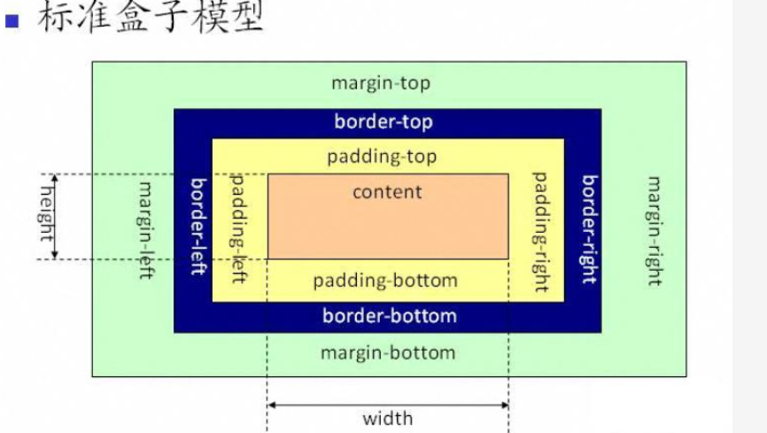
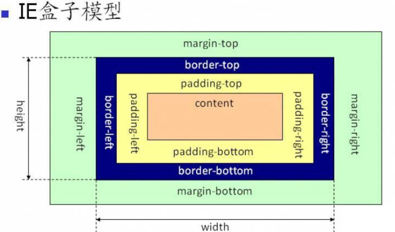

## 块级元素并不等价于display:none
有三种定义形式
- display: block
- display: table
- display: list-item

其中list-item不推荐使用。原因
- list-item字符比较多，其他都是5个字符
- 会出现不需要的项目符号
- IE不支持微元素的display值为list-item。（因为list-item有一个附加盒子——标记盒子。而IE无法创建这个盒子）

## 内联元素并不等价于display:inline
有三种定义形式
- display: inline
- display: inline-block
- display: list-table

## width/height
### width/height作用在哪个盒子上？
内在盒子，也就是容器盒子

### width:auto(默认值)的一些特性
- 外部尺寸与流体特性
    + 正常流宽度
    + 格式化宽度。出现在绝对定位模型中，也就是position为absolute或fixed。一般情况下绝对定位模型表现出包裹性。宽度由内部尺寸决定。而对于非替换元素，当left/right,top/bottom的属性值存在时，元素的宽度就表现为“格式化宽度”，其宽度是相对于具有定位特性（position不是static）的祖先元素计算的。
- 内部尺寸与特性
    + 包裹性:元素的尺寸由内部元素决定，但永远小于“包含快”容器的尺寸（除非容器尺寸小于元素的首选最小宽度）。
    + 首选最小宽度（东亚文字最小宽度14px，西方文字最小宽度由特定的连续的英文字符单元决定
    + 最大宽度：最大的连续内联盒子的宽度

### CSS盒模型
- **ie盒子模型**： ie 盒子模型的范围也包括 margin、border、padding、content，和标准 w3c 盒子模型不同的是：ie 盒子模型的width =  content + border + padding。
- **标准w3c盒子模型**：标准 w3c 盒子模型的范围包括 margin、border、padding、content，并且width = content 


- 例：一个盒子的 margin 为 20px，border 为 1px，padding 为 10px，content 的宽为 200px、高为 50px，假如用标准 w3c 盒子模型解释，那么这个盒子需要占据的位置为：宽 20\*2+1\*2+10\*2+200=262px、高 20\*2+1\*2\*10\*2+50=112px，盒子的实际大小为：宽 1\*2+10\*2+200=222px、高 1\*2+10\*2+50=72px；假如用ie 盒子模型，那么这个盒子需要占据的位置为：宽 20\*2+200=240px、高 20\*2+50=70px，盒子的实际大小为：宽 200px、高 50px
- 使用“标准模式”即可实现兼容（<!DOCTYPE html> ），使用标准w3c盒子模型。 不兼容只发生在“怪异模式”下

### 父元素无height，子元素height=100%无效
- 浏览器渲染时，下载文档内容-->加载头部样式资源-->然后从上而下，自外而内的顺序渲染DOM内容。就是会**先渲染父元素，后渲染子元素**，是有先后顺序的。因此当渲染到父元素时，子元素的width:100%并没有渲染，宽度就是内容的宽度，渲染到子元素时，父元素已经固定，此时width:100%就是已经固定好的父元素的宽度。宽度如果不够用，就会溢出。同理height也会这样渲染。那为什么宽度支持，而高度不支持呢？因为如果包含块的高度没有显式指定，并且该元素不是绝对定位的话，则**计算值为auto**。而**auto无法进行100%的表达式计算**，结果为NaN。但是宽度的解释是：如果包含块的宽度取决于该元素的宽度，那么产生的布局是css2.1中未定义的，浏览器可以根据理解去发挥。

### 如何让元素支持高度为100%
- 设置父元素的显式高度值
- 为该元素同时设置绝对定位
    + 注意：绝对定位的宽高百分比计算相对于paddingbox，而非决定定位的元素相对于content-box计算的

## min-*>max-*>!important
max-height可以用来设置高度展开的动画效果
```css
.element {
    max-height: 0;
    overflow: hidden;
    transition: max-height .25s;
}
.element.active {
    max-height: 666px;
}
```
## 幽灵空白节点
内联元素的所有解析和渲染表现就如同每个行框盒子的前面有一个“空白节点”一样。同时具有改元素的字体和行高属性的0宽度的内敛盒。
```css
div{  background-color: #cd0000;  }
span{  display: inline-block;  }
```
上述的代码就可证明幽灵节点的存在

## line-height1.5和line-height:150%的区别
区别体现在子元素继承时，如下：
- 父元素设置line-height:1.5会直接继承给子元素，子元素根据自己的font-size再去计算子元素自己的line-height。
- 父元素设置line-height:150%是计算好了line-height值，然后把这个计算值给子元素继承，子元素继承拿到的就是最终的值了。此时子元素设置font-size就对其line-height无影响了。
- 举例
    + 比如父元素设置属性：font- size:14px;line-height:1.5,child设置font-size:26px; 那么父元素：line-height = 14px * 1.5 = 21px，子元素：line-height = 26px * 1.5 = 39px。
    + 父元素设置属性：font-size:14px;line-height:150%,child设置font-size:26px; 那么父元素：line-height = 14px * 150% = 21px，子元素：line-height = 父元素的line-height = 21px。
