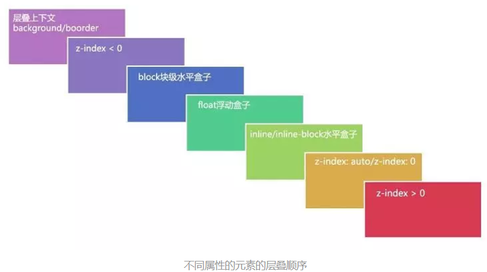

<!-- TOC -->

- [层叠水平](#层叠水平)
- [层叠顺序](#层叠顺序)
- [层叠准则](#层叠准则)
- [创建层叠上下文](#创建层叠上下文)
- [z-index对谁有效](#z-index对谁有效)
- [一些理解](#一些理解)
- [总结](#总结)
- [栗子](#栗子)

<!-- /TOC -->
## 层叠水平
英文"stacking level",决定了同一个层叠上下文元素在z轴上的显示顺序。

很多人会将层叠水平与z-index混为一谈。其实这种理解是不正确的。尽管某些情况下z-index确实可以影响层叠水平，但是只限于定位元素以及flex盒子的孩子盒子，而层叠水平所有的元素都存在。
## 层叠顺序



## 层叠准则
* 谁大谁上: 当具有明显层叠水平标识的时候，如生效z-index的属性值时，在同一个层叠上下文领域，层叠水平值大的那一个覆盖小的那一个。
* 后来居上: 当元素的层叠水平一致，层叠顺序相同的时候，在DOM流中处于后面的元素会覆盖前面的元素。


## 创建层叠上下文
只要满足一定的条件，元素就可以创建一个层叠上下文，下面就简单进行一下罗列:
1. HTML根元素会天然创建一个层叠上下文，无需特殊条件。
2. position不是static 的元素，但是z-index属性值不为auto。（所以只设置定位属性是不会创建层叠样式，一定要同时设置z-index才会产生层叠上下文）
3. 伸缩项目Flex Item，且z-index值不为 auto，即父元素 display: flex|inline-flex。
4. 元素的opacity属性值小于1。
5. 元素的 mix-blend-mode属性值不为normal。
6. 元素的filter属性值不为normal。
7. 元素的isolation属性值为isolate。
8. 在will-change中指定了任意CSS属性，即便你没有定义该元素的这些属性。
9. 元素的-webkit-overflow-scrolling属性值为touch。
10. 元素的transform值不是none

## z-index对谁有效
* 首先，z-index属性值并不是在任何元素上都有效果。它仅在定位元素（定义了position属性，且属性值为非static值的元素）上有效果。
* 判断元素在Z轴上的堆叠顺序，不仅仅是直接比较两个元素的z-index值的大小，这个堆叠顺序实际由元素的层叠上下文、层叠等级共同决定。

## 一些理解
> 为什么浮动元素和块状元素的顺序比内联元素要低？

浮动元素和块状元素一般用作布局，而内联元素都是内容。网页中最重要是什么? 当然是和内容！因此，一定要让内容的层叠顺序相当高，这样当发生层叠时，重要的文字，图片才能优先显示在屏幕上。
> 为什么定位元素层叠在普通元素的上面？

元素一旦成为定位元素，其z-index会自动生效为auto, 也就是0级别，根据层叠顺序表，就会覆盖在inline或block或float元素。而不支持z-index的层叠上下文元素天然就是z-index:auto级别，也就意味着，层叠上下文元素和定位元素是一个层叠顺序的，于是当他们发生层叠的时候，遵循的是"后来居上"准则

## 总结
- 首先判断一个元素是否被创建为层叠上下文
- 否: 普通的块状或行内或浮动元素
- 是: 根据层叠顺序表判断顺序

## 栗子
```html
<style>
.parent{
    width: 200px;
    height: 100px;
    background: #168bf5;
    /* 虽然设置了z-index，但是没有设置position，z-index无效，.parent还是普通元素，没有产生层叠上下文 */
    z-index: 1;
}
.child {
    width: 100px;
    height: 200px;
    background: #32d19c;
    position: relative;
    z-index: -1;
}
</style>
</head>
<body>
    <div class="box">
        <div class="parent">
            parent
            <div class="child">
                child
            </div>
         </div>
     </div>
</body>
```

说明： 我们发现.child被.parent覆盖了。按照“套路”来分析一下：虽然.parent设置了z-index属性值，但是没有设置position属性，z-index无效，所以没有产生层叠上下文，.parent还是普通的块级元素。此时，在层叠顺序规则中，z-index值小于0的.child会被普通的block块级元素.parent覆盖。

对于上面的栗子，我们只修改.box的属性，设置display: flex，其余属性和DOM结构不变。
```css
.box {
  display: flex;
}
```

说明：当给.box设置display: flex时，.parent就变成层叠上下文元素，根据层叠顺序规则，层叠上下文元素的background/border的层叠等级小于z-index值小于0的元素的层叠等级，所以z-index值为-1的.child在.parent上面。