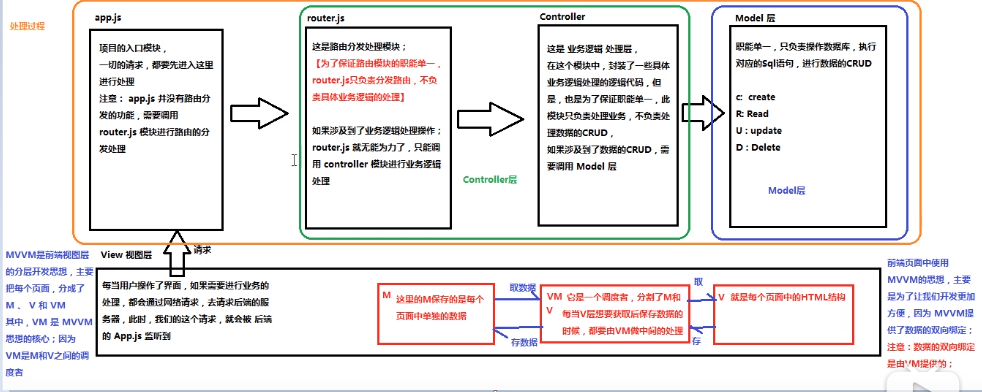
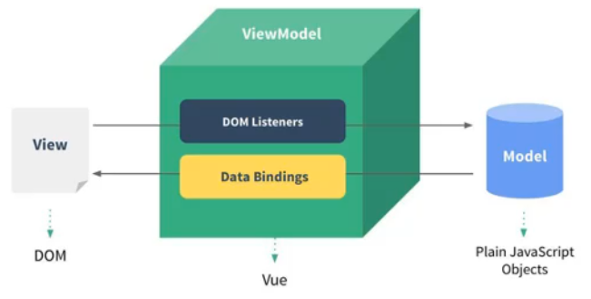
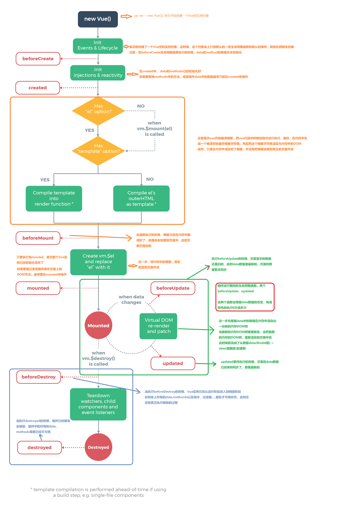
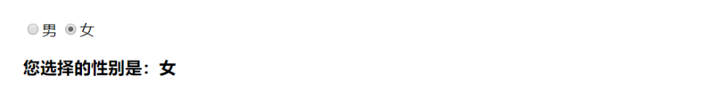
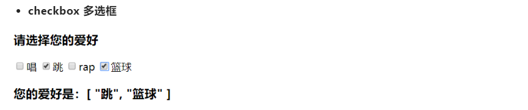
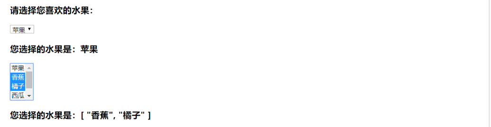

# 笔记
## 1. 简介

### 1.1 什么是Vue.js

+ Vue.js 是目前最火的一个前端框架，React是最流行的一个前端框架。(React除了用于开发网站，还可以开发app, Vue如果需要用于开发app需要借助于Weex)

### 1.2 为什么学习流行框架

+ 为了提高开发效率
+ 提高开发效率的流程: 原生JS -> Jquery -> 模板引擎 -> Angular/Vue(能够帮助减少不必要的DOM操作；提高渲染效率，双向数据绑定的概念，使得前端程序员只需要关注数据的业务逻辑，不再关心DOM是怎么渲染了)

### 1.2 渐进式框架

- 渐进式意味着你可以将Vue作为你应用的一部分嵌入其中，带来更丰富的交互体验。比如说：原来有三个页面都是用Jquery写的，现在需要用Vue进行改造，那么我们可以先将某个页面用Vue改造，仍可以保证项目的运行，然后有时间再改造其它页面。
- 或者如果你希望将更多的业务逻辑使用Vue实现，那么Vue的核心库以及其生态系统，比如Vue Core+Vue-router+Vuex （Vue全家桶），也可以满足你各种各样的需求。

### 1.3 Vue特性

- 解耦视图和数据
- 可复用的组件
- 前端路由技术
- 状态管理
- 虚拟DOM

### 1.4 MVVM架构

* MVC是后端分层开发的概念

* MVVM是前端视图的概念，主要关注视图层分离，也就是说：MVVM把前端的视图层，分为三部分，`Model`，`View`，`VM ViewModel`

* 

    

    * View 层：视图层，在前端开发中，通常就是 DOM 层，主要的作用是给用户展示各种信息 
    * Model 层：数据层，数据可能是我们固定的死数据，更多的是来自我们服务器，从网络上请求下来的数据
    * VueModel 层：视图模型层，视图模型层是 View 和 Model 沟通的桥梁，一方面实现了 Data Binding（数据绑定），将 Model 的改变实时的反应到 View 中，另一方面它实现了 DOM Listener（DOM监听），当 DOM 发生一些事件（点击、滚动、touch 等）时，可以监听到，并在需要的情况下改变对应的 Data

* vue项目中的MVVM关系

    * vue 实例所控制的元素区域，就是我们的V
    * new出来的vm对象就是vm调度者
    * data就是MVVM中的M，用来保存页面数据

## 2. 生命周期

- 生命周期
  - Vue实例有一个完整的生命周期，也就是从开始创建、初始化数据、编译模板、挂载Dom、渲染→更新→渲染、销毁等一系列过程，我们称这是Vue的生命周期。通俗说就是Vue实例从创建到销毁的过程，就是生命周期。
  - 生命周期钩子=生命周期函数=生命周期事件
  - 每一个组件或者实例都会经历一个完整的生命周期，总共分为三个阶段：初始化、运行中、销毁。
    
- 可以怎么用？
  - `beforecreate` : 举个栗子：可以在这加个loading事件 
  - `created` ：在这结束loading，还做一些初始化，实现函数自执行 
  - `mounted` ： 在这发起后端请求，拿回数据，配合路由钩子做一些事情
  - `beforeDestroy` ： 你确认删除XX吗？
  - `destroyed` ：当前组件已被删除，清空相关内容


## 3. vue基础语法

### 3.1 指令

#### 3.1.1 概述

| 指令 | 语法 | 作用 |
| ------ | ------ | ------ |
| v-clock | <div v -clock>  | 解决差值表达式的闪烁问题 |
| v-text | <div v -text='msg'> | 渲染文本 |
| v-html | <div v -html='msg'> | 以html格式解析文本并渲染 |
| v-bind | <div :title='msg' > | 属性绑定 |
| v-on | <div @click='doThing()'> | 事件绑定 |
| v-model | <input v -model='msg'> | 数据双向绑定 |
| v-for | <div v -for='item in arr'> | 循环对象数组 |
| v-if | <div v -if='flag'> | 条件判断 |
| v-show | <div v -show='flag'> | 控制元素显示或隐藏 |
| v-once | <div v-once> | 元素和组件只渲染一次，不会随着数据的改变而改变 |
| v-pre | <div v-pre='msg' > | 跳过元素的编译过程 ,将代码原封不动的解析出来 |
#### 3.1.2 v-model

v-model 其实是一个语法糖，它的背后本质上是包含两个操作：

- v-bind 绑定一个 value 属性

- v-on 指令给当前元素绑定 input 事件

  也就是说

  ```js
  <input type="text" v-model="message">
  ```

  等价于

  ```js
  <input type="text" :value="message" @input="message = $event.target.value">
  ```

v-model 结合 radio 使用



```html
<div class="app">
  <label for="male">
    <input type="radio" v-model="gender" id="male" value="男">男
  </label>
  <label for="female">
    <input type="radio" v-model="gender" id="female" value="女">女
  </label>
  <h3>您选择的性别是：{{gender}}</h3>
</div>
<script src="../js/vue.js"></script>
<script>
  const app = new Vue({
    el: '.app',
    data: {
      gender: '男'
    }
  });
</script>
```


v-model 结合 checkbox 使用



```html
<div class="app">
  <h3>请选择您的爱好</h3>
  <label for="sing">
    <input type="checkbox" v-model="hobbies" id="sing" value="唱">唱
  </label>
  <label for="jump">
    <input type="checkbox" v-model="hobbies" id="jump" value="跳">跳
  </label>
  <label for="rap">
    <input type="checkbox" v-model="hobbies" id="rap" value="rap">rap
  </label>
  <label for="basketball">
    <input type="checkbox" v-model="hobbies" id="basketball" value="篮球">篮球
  </label>
  <h3>您的爱好是：{{hobbies}}</h3>
</div>
<script src="../js/vue.js"></script>
<script>
  const app = new Vue({
    el: '.app',
    data: {
      hobbies: []
    }
  });
</script>
```


v-model 结合 select 使用



```html
<div class="app">
  <!-- 选择一个值 -->
  <h3>请选择您喜欢的水果：</h3>
  <select name="" v-model="fruit">
    <option value="苹果">苹果</option>
    <option value="香蕉">香蕉</option>
    <option value="橘子">橘子</option>
    <option value="西瓜">西瓜</option>
    <option value="榴莲">榴莲</option>
  </select>
  <h3>您选择的水果是：{{fruit}}</h3>

  <!-- 选择多个值 -->
  <select name="" v-model="fruits" multiple>
    <option value="苹果">苹果</option>
    <option value="香蕉">香蕉</option>
    <option value="橘子">橘子</option>
    <option value="西瓜">西瓜</option>
    <option value="榴莲">榴莲</option>
  </select>
  <h3>您选择的水果是：{{fruits}}</h3>
</div>
<script src="../js/vue.js"></script>
<script>
  const app = new Vue({
    el: '.app',
    data: {
      fruit: '苹果',
      fruits: []
    }
  });
</script>
```


#### 3.1.3 v-if/v-show

> v-if的特点：v-if是真正的条件渲染，会确保在切换过程中，条件块内的事件和子组件被销毁和重建（组件被重建将会调用created） 
>
> v-show的特点：每次不会进行DOM的删除和创建，只是切换元素display:none样式
>
> v-if有较高的切换性能消耗，v-show有较高的初始渲染消耗。
>
> 如果元素涉及到频繁切换，最好不用v-if,如果元素可能永远不会被显示出来则推荐使用v-if

### 3.2 自定义指令
```js
Vue.directive('focus', {
    //每当指令绑定到元素上的时候，会立刻执行这个 bind 函数，只会执行一次
    bind: function (el) {
        // 在每个函数中，第一个参数永远是el，表示被绑定了指令的那个元素，这个el参数是一个原生的JS对象
        // el.focus()  该操作不生效，时机不对
    }, 
    //inserted表示元素 插入到DOM中的时候，会执行 inserted 函数【触发一次】
    inserted: function (el) {
        el.focus()
    }, 
    //当VNode（组件）更新的时候，会执行 updated ，可能会触发多次
    updated: function () {}
})
Vue.directive('color', {
    //每当指令绑定到元素上的时候，会立刻执行这个 bind 函数，只会执行一次
    bind: function (el, binding) {
        console.log(binding)
        el.style.color = binding.value
    }
})
```

### 3.3 属性/方法

#### 3.3.1 method

点击对象

```js
 <!-- 在事件定义时，即需要event对象，又需要其他参数 $event就是点击对象-->
  <button @click="btnClick(123,$event)">按钮</button>
```

示例

```js
methods: {
    btnClick() {
        console.log("btn Click...")
    }
}
```


#### 3.3.2 computed

每个计算属性都包含一个 getter 和一个 setter，getter 用来读取值，setter 用来设置值（但 setter 不常用） 

```js
computed: {
    fullName : {
        set: function () {
        },
        get : function () {
            return this.firstName + ' ' + this.lastName
        }
    }
}
```

由于setter方法不常用，所以一般会去掉setter，然后进行简写，默认直接调用getter

```js
computed: {
    fullName() {
        return this.firstName + ' ' + this.lastName
    }
}
```


#### 3.3.3 watch

 给变量绑定监听事件，一旦数据发生变化，就会触发这个函数

```js
 watch: {
     // 监听firstName的值，当发生改变的时候，将fullName的值同步改变
    firstName(newVal, oldVal) {
        this.fullName = this.lastName + newVal;
    },
    lastName(newVal, oldVal) {
            this.fullName = this.lastName + this.firstName;
    },
    '$route.path'(newVal,oldVal){
            conosle.log(oldVal+'-------->'+newVal)
    }
},
```


#### 3.3.4 方法对比

- `computed`属性的结果会被缓存，除非依赖的响应式属性变化才会重新计算，主要当作属性使用
- `methods`方法表示一个具体操作，主要书写业务逻辑
- `watch`一个对象，键是需要观察的表达式，值是对应的回调函数，主要用来监听特定数据的变化，从而进行某些具体的业务逻辑操作。可以看作是`methods`和`computed`的结合

#### 3.3.5 filters

```js
filters: {
    showPrice(price) {
        return '￥' + price.toFixed(2)
    }
}
```


### 3.4 样式

#### 3.4.1 标签中使用样式

- 数组
  - `<h1 :class="['red','thin']>test</h1>`
- 三元表达式
  - `<h1 :class="['red','thin'，isactive?'active':'']>test</h1>`
- 数组中设置对象
  - `<h1 :class="['red','thin',{'active':isactive}]>test</h1>`
- 直接使用对象
  - `<h1 :class="{'red':true,'active':isactive}>test</h1>`
- 在style中直接写
  - `<p :style={'color':color,'font-weight':'bold'}>test</p>`

#### 3.4.2 外部样式文件

- `@import 路径`
  - 如 `@import "../../common/stylus/mixins.styl"; `

### 3.5 事件修饰符

js的事件默认采用冒泡机制，就是某一个元素相应如点击事件时，会一层层向祖先元素冒泡，触发祖先元素的点击事件

| 事件修饰符 | 语法 | 作用 |
| ------ | ------ | ------ |
| stop | <div @click.stop="doThing"> | 阻止事件冒泡 |
| prevent | <a href='...' @click.prevent='doThing' > | 阻止默认事件(这里阻止了href的跳转) |
| capture | <div @click.capture='doThing'> | 事件捕获，从外往里相应事件和默认冒泡相反 |
| self | <div  @click.self='doThing' > | 只有点击当前元素，才会触发该元素绑定的事件 |
| once | <div @click.once='doThing'> | 只触发一次 |
| lazy | <input v-model.lazy='message'> | 让数据在失去焦点或者回车时才更新(input标签) |
| number | <input v-model.number='age'> | 让输入框中输入的内容自动转化为number类型 |
| trim | <input v-model.trim='message'> | 过滤内容左右两边的空格 |

## 4. 动画
### 4.1 使用过度类名
* 过度类名默认以`v-`开头，若需要改成自定义的名字,直接将css中的v替换成newName,然后<transition name="newName">
* 使用`<transition></transition>`包括需要动画的元素
```html
    <transition>
            <h3 v-if="flag">这是h3标签——有动画</h3>>
    </transition>
```
* 设置动画样式
```css
    /* v-enter 是进入之前，元素的起始状态 */
    /* v-leave-to 是动画离开之后，离开终止的状态，此时，元素动画已经结束 */
    /* v-enter-active 入场动画的时间段*/
    /* v-leave-active 离场动画的时间段*/
    .v-enter-active,
    .v-leave-active {
        transition: all .8s ease;
    }
    .v-enter,
    .v-leave-to {
        transform: translateX(100px);
        opacity: 0;
    }
```
### 4.2 使用第三方类
```html
    <!-- 导入animate.css -->
    <link rel="stylesheet" href="https://cdn.bootcss.com/animate.css/3.7.0/animate.css">
    <!-- 使用 :duration="毫秒值" 设置进场和出场 时候的动画时长 -->
    <!-- 使用 :duration="{enter:毫秒值,leave:毫秒值}" 分别设置进场和出场的动画时间值 -->    
    <transition enter-active-class="bounceIn" leave-active-class="bounceOut" :duration="200">
        <h3 v-if="flag" class="animated">hello vue.js</h3>
    </transition>   
```
### 4.3 使用钩子函数
* 建议参考[vue官网](https://cn.vuejs.org/v2/guide/transitions.html)

## 5. 组件
* 什么是组件：组件的出现，就是为了拆分Vue实例的代码，能够让我们以不同的组件，来划分不同的功能模块，将来我们需要什么样的功能，就可以去调用对应的组件即可。
* 组件和模块化的不同：
    * 模块化：是从代码的逻辑角度进行划分的，保证每个功能模块职责单一。
    * 组件化：是从UI界面的角度划分的，方便代码的重用。

###  5.1 定义全局组件

*  方式1：使用Vue.extend 来创建全局的Vue组件
```js
   let com1 = Vue.extend({
       // 通过temloate属性，指定了组件要展示的HTML结构
       template: '<h3>这是用Vue.extend创建的组件</h3>' //内部必须只有一个根节点
    })
   
    // 使用Vue.component('组件的名称',创建出来的的组件模板对象)
    // 定义的时候可以用驼峰法，但是调用时必须使用“-”
    Vue.component('myCom1', com1);
```

合并写法

```js
Vue.component('mycom2', Vue.extend({
    // 通过temloate属性，指定了组件要展示的HTML结构
    template: '<h3>这是用Vue.component两步合并创建的组件</h3>' //内部必须只有一个根节点
}))
```


* 方式2：语法糖
```js
   Vue.component('mycom3', {
       template: '<h3>这是用Vue.component一步创建的组件</h3>' //内部必须只有一个根节点
    })
```

* 方式3：页面结构单独抽离，编辑的时候就会有智能提示
```html
    <!-- 在被控制的#app外面，使用template元素，定义组件的HTML结构 -->
    <template id="tmp1">
        <div>
            <h3>这是通过template元素，在外部创建的组件</h3>
        </div>
    </template>
    <script>
     Vue.component('mycom4', {
        template: '#tmp1'
    })
    </script>
```
### 5.2 定义私有组件  
```js
    //在vue实例化对象中添加components属性
    components: { //定义实例内部私有组件
        login: {
            template: "<h1>私有的login组件</h1>"
        },
        login2: {
            template: "#tmp1"
        }
    }
```
### 5.3 组件中的data
* 组件的 data 和 实例的data 有一点不一样，实例中的data可以为一个对象，但是组件中的data必须是一个方法
* 组件中的data 除了必须为一个方法外，这个方法内部，还必须返回一个对象才行

### 5.4 组件显示
```html
    // 方式1：
    <login v-if="type=='login'"></login>
    //方式2：is的属性值就是组件的名称
    <component :is="type"></component>
```
### 5.5 .vue方式

1. 在components文件夹中新建一个`Header.vue`文件（以Header为例）

2. 在Header的template中写下模板
    * 如果组件的有部分在不同的页面中结构不同或不一定显示，则利用`插槽slot`来占位，通过`name`属性来辨别不同的slot
    * 如果是一些变量上的区别，则利用`{{}}`来接收数据
    ```html
    <header class="header">
        <slot name="left"></slot>
        <span class="header_title">
          <span class="header_title_text ellipsis">{{title}}</span>
        </span>
        <slot name="right"></slot>
    </header>
    ```
    ```js
    export default {
        props: {
            title: String
        }
    }
    ```

3. 在需要引入该组件的文件中引入
    ```js
    import HeaderTop from '../../components/HeaderTop/HeaderTop'
    export default {
        ...
        components: {
            HeaderTop
        }
    }
    ```

4. 使用组件

    ```html
    <HeaderTop title='首页'>
        <!-- 插入插槽 ，通过slot属性来表明插入的位置-->
        <!-- 如果没有这部分，就不需要这部分代码 -->
        <span class="header_search" slot="left">
            <i class="iconfont icon-tubiao-"></i>
        </span>
    </HeaderTop>
    ```

## 6. 父子组件传值

### 6.1 父传子

默认子组件是无法直接获取父组件绑定的数据

父组件如何向子组件传值/方法？

- 父组件在引用子组件的时候，通过属性绑定（v-bind）/（v-on）的形式，把需要的传递给子组件的数据，以属性绑定的形式，传递到子组件内部，供子组件使用 (子组件获取的 = 父组件绑定的

  `<com1 v-bind:parentmsg='msg' v-on:parentshow='show'></com1> `

- 接收值：在子组件中，把父组件传递过来的parentmsg属性，先在`props`数组中，定义一下，这样才能使用这个数据，尽量不要修改props中的数据

  `props:['parentmsg']`

  ```js
  components: {
      com1: {
          template: "<h1>这是子组件---{{parentmsg}}</h1>",
              // 接收父组件的值  方式一：直接接收
              props:['parentmsg'],
              // 接收父组件的值  方式二：进行限制
              props: {
                 parentmsg: {
                     type: String,
                     default: 'hello',
                     required: true,
                     // 自定义验证方式
                     validator(value) {
                         return ['hello', 'lala', 'ok'].indexof(value) !== -1
                     }
                 },
                 list: {
                   // 数组或对象类型，默认值必须设为方法
  				type : Array,
                    default() {
                       return []
                    }
                 }
              }
      }
  }
  ```

  

### 6.2 子传父

需要自定义事件

- 父组件传入方法

  `<com1 v-on:parentshow='show'></com1> `

- 子组件通过`$emit()`触发父组件执行方法

  ```js
  components: {
      com1: {
          template: "<h1>这是子组件</h1>",
          //触发父组件的方法
          methods: {
             myclick(){
                // 触发了父组件的parentshow方法，并传入123实参
                this.$emit('parentshow',123)
             }
          }
      }
  }
  ```


## 7. 父子组件访问

### 7.1 访问子组件

#### 7.1.1 $children(不常用 )

`this.$children` 是一个数组类型，它包含所有子组件对象，可以通过遍历，取出所有子组件的信息 

$children 的缺陷：

通过 $children 访问子组件时，是一个数组类型，访问其中的子组件必须通过索引值，但是当子组件过多，我们需要拿到其中一个时，往往不能确定它的索引值，甚至还可能会发生变化

```js
console.log(this.$children[0].name);
```


#### 7.1.2 $refs(常用)

有时候，我们想明确获取其中一个特定的组件，这个时候就可以使用 $refs 

1. 首先，我们通过 ref 给某一个子组件绑定一个特定的 ID 

   ```js
   <cpn ref="child1"></cpn>
   ```

2. 其次，通过 `this.$refs.ID` 就可以访问到该组件了 

   ```js
   console.log(this.$refs.child1.name);
   ```

   

### 7.2 访问父组件

#### 7.2.1 $parent(不常用)

访问父组件

```js
console.log(this.$parent.name);
```

#### 7.2.2 $root(不常用)

访问根组件 

```js
console.log(this.$root.name);
```

- 尽管在 Vue 开发中，我们允许通过 $parent 来访问父组件，但是在真实开发中尽量不要这样做，因为这样耦合度太高了
- 子组件应该尽量避免直接访问父组件的数据，如果我们将子组件放在另外一个组件之内，很可能该父组件没有对应的属性，往往会引起问题
- 另外，通过 $parent 直接修改父组件的状态，那么父组件中的状态将变得飘忽不定，很不利于调试和维护
- 也不常用 $root 来访问根组件（即 vue 实例），因为根组件中一般只存放路由等重要数据，不存放其他信息


## 8. ref获取DOM元素
* DOM元素设置`ref`属性值，vue实例通过`this.$refs.***`获取

* 当给子组件设置ref时，可以获取子组件中的数据和方法。

  ```html
  <h3 id="myh3" ref="myh3">哈哈哈，好逗啊</h3>
  <hr>
  <login ref="mylogin"></login>
  <script>
      ...
      methods: {
          getElement() {
              console.log(this.$refs.myh3.innerText)
              console.log(this.$refs.mylogin.msg)
          }
      },
      ....
  </script>
  ```


## 9. 插槽slot (v2.6.0前)

### 9.1 具名插槽

1. 在子组件中定义插槽 HeaderTop.vue

   ```html
   <header class="header">
       <slot name="left"></slot>
       <span class="header_title">
         <span class="header_title_text ellipsis">{{title}}</span>
       </span>
       <slot name="right"></slot>
   </header>
   ```

2. 在父组件中使用插槽

   如果没有指定slot值，那么代码会替代没有指定name值的插槽

   ```html
   <HeaderTop title='首页'>
       <!-- 插入插槽 ，通过slot属性来表明插入的位置-->
       <!-- 如果没有这部分，就不需要这部分代码 -->
       <span class="header_search" slot="left">
           <i class="iconfont icon-tubiao-"></i>
       </span>
   </HeaderTop>
   ```

### 9.2 作用域插槽

父组件替换插槽的标签，但是内容由子组件来提供 

1. 在子组件的插槽标签上绑定传递给父组件的数据，属性名是可以自定义的 

   ```html
   <!-- cpn.vue -->
   <slot :data = books></slot>
   ```

2. 在父组件使用插槽的时候通过定义`slot-scope = "slot"`

   ```html
   <cpn>
   	<tempate slot-scope = "slot">
           <span>{{slot.data.jpin('-')}}</span>
       </tempate>
   </cpn>
   ```

## 10. 插槽slot (v2.6.0后)

> 在 2.6.0 中，我们为具名插槽和作用域插槽引入了一个新的统一的语法 (即 `v-slot` 指令)。它取代了 `slot` 和 `slot-scope` 这两个目前已被废弃但未被移除且仍在[文档中](https://cn.vuejs.org/v2/guide/components-slots.html#%E5%BA%9F%E5%BC%83%E4%BA%86%E7%9A%84%E8%AF%AD%E6%B3%95)的特性。新语法的由来可查阅这份 [RFC](https://github.com/vuejs/rfcs/blob/master/active-rfcs/0001-new-slot-syntax.md)。 

### 10.1 具名插槽

具名插槽通过指令参数 `v-slot:插槽名` 的形式传入，可以简化为 `#插槽名` 

插槽定义时，仍使用name属性定义插槽名

```html
<base-layout>
    <template v-slot:header>
        <h1>Here might be a page title</h1>
    </template>
    
	<!-- 默认插槽 -->
    <template v-slot:default>
        <p>A paragraph for the main content.</p>
        <p>And another one.</p>
    </template>

    <!-- 简写形式 -->
    <template #footer>
        <p>Here's some contact info</p>
    </template>
</base-layout>
```

### 10.2 作用域插槽

作用域插槽通过 `v-slot:xxx="slotProps"` 的 slotProps 来获取子组件传出的属性 

1. 在子组件中定义需要给父组件传入属性

   ```html
   <span>
     <slot v-bind:user="user">
       {{ user.lastName }}
     </slot>
   </span>
   ```

2. 在父组件使用这个属性

   注意默认插槽的缩写语法不能和具名插槽混用，因为它会导致作用域不明确

   ```html
   <current-user>
     <template v-slot:default="slotProps">
       {{ slotProps.user.firstName }}
     </template>
   </current-user>
   ```

3. demo

   ```html
   <template>
     <child>
      <!--默认插槽-->
      <template v-slot>  // v-slot:default
        <div>默认插槽</div>
      </template>
      <!--具名插槽-->
      <template #header>  // v-slot:header
        <div>具名插槽</div>
      </template>
      <!--作用域插槽-->
      <template #footer="slotProps">  //v-slot:footer
        <div>
         {{slotProps.testProps}}
        </div>
      </template>
     <child>
   </template>
   ```

   

### 10.3 动态插槽名（ 新增）

动态指令参数也可以用在 v-slot 上，来定义动态的插槽名： 

```html
<base-layout>
 <template v-slot:[dynamicSlotName]>
   ...
 </template>
</base-layout>
```

## 11. 数据请求

### 911.1 axios请求后台

- 黑马视频中用的是vue-resource，这个库已经被淘汰了，建议使用axios. 所以我在写案例的时候也改成了axios的方式

  ```js
  //基本写法
  axios.get('/BrandCase/getList').then(function (response) {
          console.log(response)
  }).catch(function (error) {
          console.log(error)
  })
  
  axios.post('/BrandCase/delete',{id:id}).then(function (response) {
          console.log(response)
  }).catch(function (error) {
          console.log(error)
  })
  ```

- 全局配置根路径

  `axios.defaults.baseURL = 'http://127.0.0.1:5050/'`

### 9.2. mock模拟接口

- 使用`mock.js`
- 具体使用参见同级目录下的`模拟生成api数据.md`


## 9. 路由

### 什么是路由
* 后端路由：对于普通网站，所有的超链接都是URL地址，所有的URL地址都对应服务器上对应的资源
* 前端路由：对于单页面的应用程序来说，主要通过URI中的hash(#号)来实现不同页面之间的切换，同时，hash有一个特点，HTTP请求中不会包括hash相关的内容，所以单页面的应用程序中的页面跳转主要用hash实现。（不会发起HTTP请求）
* 在单页面应用程序中，这种通过hash改变来切换页面的方式，称作前端路由
### 基本路由代码
* 定义组件
    ```js
    const login = { template: '<div>这是login组件</div>' }
    const register = { template: '<div>这是register组件</div>' }
    ```
* 定义路由规则
    ```js
    const routes = [
        { path: '/login', component: login },
        { path: '/register', component: register }                
        { path: '/', redirect:'/login' }
    ]
    ```
* 创建路由实例
    ```js
    const router = new VueRouter({
        routes // (缩写) 相当于 routes: routes
    })
    ```
* vue实例中挂载路由
    ```js
    const app = new Vue({
        router:router
    }).$mount('#app')
    ```
* 页面显示路由
    ```html
    <router-view></router-view>
    ```
### 选择路由链接的高亮
* 方法一：利用vue-router的自带的方法
    * vue-router提供了一个默认的css类名，表明当前选中的组件的元素的样式：`.router-link-active`
        ```css
        .router-link-active{
            color:tomato;
            font-size: 20px;
        }
        ```
    * 自定义类名：需要修改VueRouter实例中的`linkActiveClass`
        ```css
        .myClass{
            color:teal;
            font-size: 20px;
        }
        ```
        ```js
            const router = new VueRouter({
            routes,
            linkActiveClass:'myClass'
        })
        ```
* 方法二：手动模拟
    * 在每个router-link标签中判断当前的路由是否为改标签对应的路由，是则加上某个class
        ```html
         <router-link to="/home" class="{on:'/home' === $route.path}"></router-link>
        ```
### 路由传参
> $router: 路由器对象, 包含一些操作路由的功能函数, 来实现编程式导航(跳转路由)

> $route: 当前路由对象, 一些当前路由信息数据的容器, path/meta/query/params
* 方式1：`?`传值+`route.query.***`获取
    ```html
    <router-link to="/login?id=7&&name=summer">login</router-link>
    ```
    ```js
     const login = {
        template: '<div>这是login组件---{{$route.query.id}}----{{$route.query.name}}</div>',
     }
    ```
* 方式2：路由规则编写 +`/`传值+`route.params.***`获取
    ```html
    <router-link to="/login/7/summer">login</router-link>
    ```
    ```js
    const login = {
        template: '<div>这是login组件---{{$route.params.id}}----{{$route.params.name}}</div>',
    }
    const routes = [{
        path: '/login/:id/:name',
        component: login
    }]
    ```
### 使用children属性去匹配子路
* 定义`account`组件
    ```html
    <template id="account">
        <div>
            <h1>这是account组件</h1>
            <router-link to="/account/login">登录</router-link>
            <router-link to="/account/register">注册</router-link>
            <router-view></router-view>
        </div>
    </template>
    ```
* 定义`login`和`register`的组件
* 定义路由
    ```js
    const routes = [{
        path: '/account',
        component: account,
        children: [
            {path: 'login', component: login},
            {path: 'register',component: register},
        ]
    }]
    ```
### 指定router-view显示的区域
* 给`router-view`加`name`属性，不加默认为`default`
    ```html
     <router-view></router-view>
     <div class="content">
        <router-view name="left"></router-view>
        <router-view name="main"></router-view>
     </div>
    ```
* 路由匹配规则中设置组件的名字
    ```js
    const router = new VueRouter({
        routes: [{
            path: '/',
            components:{
                'default':header,
                'left':leftBox,
                'main':mainBox
            }
        }]
    })
    ```

## render渲染页面
* 之前学的是利用components注册组件，现在render函数也可以
* 区别：component注册的组件不会覆盖该vue实例内的其它元素，render方法会覆盖
* render是一个函数，第一个参数是一个方法，调用它，能够把指定的组件模板渲染为html结构
* render返回一个结果，替换页面中el指定的容器
    ```js
    const app = new Vue({
        render:function(createElements){
            return createElements(login)
        }
    }).$mount('#app')
    ```

## 14. webpack中使用vue
### 14.1 安装
* 初始化webpack的项目(包括一些列babel)
* 在webpack中使用vue步骤
    * 安装`vue`: `npm i vue --save-dev`

    * 在main.js中导入Vue: `import Vue from 'vue'`

    * 在main.js正常new一个Vue，发现不能正常执行、

        * 【原因】：默认导入的vue包为runtime-only模式，需要修改

        * 【修改】

            * 方式一： `import Vue from 'vue/dist/vue.js' `

            * 方式二： 在vue模块中的`package.json`中修改main的参数为`"dist/vue.js"`

            * 方式三： 在webpack.config.js中加与entry平级的resolve配置

                ```json
                resolve:{
                    alias:{
                        'vue$':'vue/dist/vue.js'
                    }
                }
                ```

                
### 14.2 导入.vue文件
* .vue文件由三部分组成
	1. template
	2. script
	3. style
* 默认webpack无法打包.vue相关的文件
	* 安装相关loader ：`npm i vue-loader vue-template-compiler -D`
	* 在webpack.config.js新增配置规则
    ```js
    { test: /\.vue$/, use: 'vue-loader'},
    ```
	* 发现报错了
        * 【原因】Vue-loader在15.*之后的版本都是 vue-loader的使用都是需要伴生 VueLoaderPlugin的
	    * 【解决方法】 在webpack.config.js中加入
        ```js
        const VueLoaderPlugin = require('vue-loader/lib/plugin');
        plugins: [ // make sure to include the plugin for the magic    
            new VueLoaderPlugin()
        ],
        ```
    * 如果是runtime-only模式，需要使用render()方式渲染

### 14.3 使用路由
* 安装：`npm i vue-router --save-dev`
* 在main.js中导入：
    ```js
    import VueRouetr from 'vue-router'
    Vue.use(VueRouetr);
    ```
## mint-UI
### 全局导入
* 安装`mint-ui`: `npm install mint-ui`
* 导入：
    ```js
    import MintUI from 'mint-ui'
    import 'mint-ui/lib/style.css'
    import App from './App.vue'
    ```
### 按需导入
* 安装`mint-ui`: `npm install mint-ui`
* 安装 `babel-plugin-component`:`npm install babel-plugin-component -D`
* 在webpack配置文件中配置
    ```js
    {
        "presets": ["@babel/preset-env"],
        "plugins": [

            "@babel/plugin-transform-runtime",
            "@babel/plugin-proposal-class-properties",
            ["component", {
                "libraryName": "mint-ui",
                "style": true
            }]
        ]
    }
    ```
    * 按需导入：
    ```js
    import { Button} from 'mint-ui'
    Vue.component('myButton',Button)  //第一个参数是别名vue
    ```

## MUI
* 样式代码段

## vuex
### 什么是Vuex
* Vuex 是一个专为 Vue.js 应用程序开发的状态管理模式。它采用集中式存储管理应用的所有组件的状态，并以相应的规则保证状态以一种可预测的方式发生变化
* 什么情况下我应该使用 `Vuex`？
    * 如果您不打算开发大型单页应用，使用` Vuex `可能是繁琐冗余的。确实是如此——如果您的应用够简单，您最好不要使用 Vuex。一个简单的 store 模式就足够您所需了。但是，如果您需要构建一个中大型单页应用，您很可能会考虑如何更好地在组件外部管理状态，Vuex 将会成为自然而然的选择
### vuex的核心
* 每一个 Vuex 应用的核心就是 `store（仓库）`。`store`基本上就是一个容器，它包含着你的应用中大部分的状态 (state)。Vuex 和单纯的全局对象有以下两点不同：
* Vuex 的状态存储是响应式的。当 Vue 组件从 store 中读取状态的时候，若 store 中的状态发生变化，那么相应的组件也会相应地得到高效更新。
* 不能直接改变 store 中的状态。改变 store 中的状态的唯一途径就是显式地`提交 (commit) ``mutation`。这样使得我们可以方便地跟踪每一个状态
### 配置步骤
1. 装包导包注册：`npm install vuex --save-dev`
2. 创建store实例
3. 将vuex创建的store实例挂载到vue实例中
    main.js
    ```js
    import store from './store'
    new Vue({
        ...
        store
    })
    ```
- 其中创建store实例的步骤
    - 在src下创建store文件夹，其下分别创建index.js、state.js、mutation-types.js、mutations.js、actions.js、getters.js
    - index.js: store入口，生成store实例暴露对外的方法
        ```js
        import Vue from 'vue'
        import Vuex from 'vuex'
        import state from './state'
        import mutations from './mutations'
        import actions from './actions'
        import getters from './getters'
        Vue.use(Vuex)

        export default new Vuex.Store({
            state,
            mutations,
            actions,
            getters
        })
        ```
    - state.js: 放需要管理的数据
        ```js
        export default {
            latitude: 40, // 纬度
            longtitude: 116, // 经度
            address: {}, // 地址相关的信息对象
        }
        ```
    - mutation-types.js: 
        ```js
        export const RECEIVE_ADDRESS = 'receive_address' // 接收地址
        export const RECEIVE_CATEGORYS = 'receive_categorys' // 接收分类
        export const RECEIVE_SHOPS = 'receive_shops' // 接收商家数组
        ```
    - mutation.js: 更改state的数据
        ```js
        import {
            RECEIVE_ADDRESS,
            RECEIVE_CATEGORYS,
            RECEIVE_SHOPS
        } from './mutation-types'

        export default {
            [RECEIVE_ADDRESS] (state, {address}) {
                state.address = address
            },
            [RECEIVE_CATEGORYS] (state, {categorys}) {
                state.categorys = categorys
            },
            [RECEIVE_SHOPS] (state, {shops}) {
                state.shops = shops
            }
        }
        ```
    - actions.js
        ```js
        import {
            RECEIVE_ADDRESS,
            RECEIVE_CATEGORYS,
            RECEIVE_SHOPS
        } from './mutation-types'
        import {
            reqAddress,
        } from '../api'

        export default {
        // 异步获取地址
        async getAddress ({commit, state}) {
                // 异步发送ajax请求
                const geohash = state.latitude + ',' + state.longtitude
                const res = await reqAddress(geohash)
                // 提交一个mutation
                if (res.code === 0) {
                    const address = res.data
                    commit(RECEIVE_ADDRESS, {address})
                }
            },
        }
        ```
- 另一种编程风格
    - 生成store实例
    ```js
        const store = new Vuex.Store({
        state: {
            count: 0
        },
        mutations: {
            increment (state) {
            state.count++
            }
        }
        })
    ```
    - 用`commit`来调用`mutation`来修改`store state`中数据
        mutation中最多传递两个参数，第一个固定为`state`,第二个为传递的参数，若需传递多个数据，可以用对象的形式传
        ```js
        methods: {
            add(){
                this.$store.commit('increment', 4);
            }
        }
        ```
    - 用`getters`的方法读取`store state`中的数据
        getters只负责对外提供数据，修改数据得用mutations
        ```js
        optCount:function (state) {
            return '当前最新的count值是:'+ state.count
        }
        //组件获取数据
        $store.getters.optCount
        ```
    - 组件中获取store中的数据
        -  `this.$store.state.***`

## 优化

### 浏览记录（回退）
- 默认进行路由组件切换时使用的是push的方式添加到浏览记录中，如果不需要可以在相应的路由组件上加入`replace`属性

### 缓存路由组件对象
- 作用：复用路由组件对象，复用路由组件获取的后台数据。切换组件后，不会销毁与重建组件，会将组件的状态进行缓存
- 实现：在需要缓存的组件外围添加标签`<keep-alive>`
- 在浏览器内存

### 路由组件懒加载
- 背景：默认利用`npm run build`进行生成环境打包时，会生成如下所示的三个js文件，这就意味所有组件的js代码会打包合并到一个js文件中，这样会导致线上项目初始打开一个页面时，会一次性加载所有组件的js代码。这样初始的性能会不好。
    - ① app: 所有自己写的js文件
    - ② manifast: 与webpack相关的js文件
    - ③ vender: 与第三方包相关的js文件
- 作用：打包的时候进行代码风格，在不同的时机加载
- 实现：如在运行代码的时候只加载当前载入的模块
    - 原来的方式
    ```js
    import MSite from '../pages/MSite/MSite.vue'
    import Order from '../pages/Order/Order'
    import Profile from '../pages/Profile/Profile.vue'
    import Search from '../pages/Search/Search'
    ```
    - 按需的方式：将组件以函数的方式加载，这样只有在组件第一次在浏览器中被加载的时候才会执行这个组件函数
    ```js
    const MSite = () => import('../pages/MSite/MSite.vue')
    const Order = () => import('../pages/Order/Order')
    const Profile = () => import('../pages/Profile/Profile.vue')
    const Search = () => import('../pages/Search/Search')
    ```
- 控制与后台请求响应js代码的时机

## 图片懒加载
- 使用`vue-lazyload`插件
```js
// main.js
import VueLazyload from 'vue-lazyload'
import loading from './common/imgs/loading.gif'
Vue.use(VueLazyload, { // 内部自定义一个指令lazy
  loading
})
// 对应的标签
 
// 改为
 

```

## 格式化时间
- 定义全局过滤器
```js
// src/filters/index.js
import Vue from 'vue'
import moment from 'moment'

Vue.filter('date-format', function (value, format = 'YYYY-MM-DD HH:mm:ss') {
  return moment(value).format(format)
})
```
- main.js中导入
```js
import './filters'
```
- 使用
```html
<span>info.date | date-format</span>
```

## 打包优化
1. vue脚手架提供了一个用于可视化分析打包文件的包`webpack-bundle-analyzer`和配置
2. 启动打包可视化：`npm run build --report`

3. 优化：使用`date-fns`代替`moment`