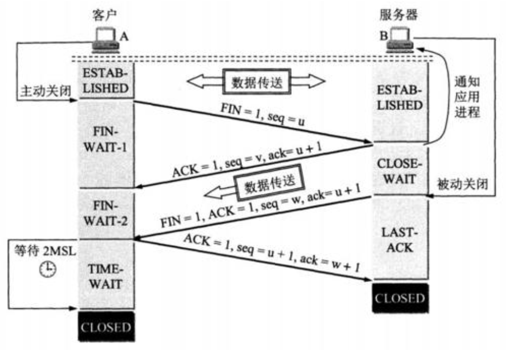

<!-- TOC -->

- [浏览器输入url到展示页面的过程](#浏览器输入url到展示页面的过程)
    - [1. 查看缓存](#1-查看缓存)
    - [2. DNS解析](#2-dns解析)
    - [3. 建立TCP连接](#3-建立tcp连接)
    - [4. 建立SSL连接](#4-建立ssl连接)
    - [5. 客户端发起HTTP请求](#5-客户端发起http请求)
    - [6. 服务器处理响应请求](#6-服务器处理响应请求)
    - [7. 页面呈现](#7-页面呈现)
    - [8. 连接关闭](#8-连接关闭)
- [优化](#优化)
    - [1. 缓存（请求资源的过程中）](#1-缓存请求资源的过程中)
    - [2. 持久连接](#2-持久连接)

<!-- /TOC -->
## 浏览器输入url到展示页面的过程

### 1. 查看缓存
- 调用 Service Worker 的 fetch 事件响应
- 查看 memory cache
- 查看 disk cache。这里又细分：
    1. 如果有强制缓存且未失效，则使用强制缓存，不请求服务器。这时的状态码全部是 200
    2. 如果有强制缓存但已失效，使用协商缓存，比较后确定 304 还是 200。完成这一步需要进行DNS解析等以下所有步骤
- 发送网络请求，等待网络响应
- 把响应内容存入 disk cache (如果 HTTP 头信息配置可以存的话)
- 把响应内容 的引用 存入 memory cache (无视 HTTP 头信息的配置)
- 把响应内容存入 Service Worker 的 Cache Storage (如果 Service Worker 的脚本调用了 cache.put())

### 2. DNS解析

||DNS|
|--|--|
|目的|将域名解析为IP地址|
|原因|网络通讯大部分是基于TCP/IP，而TCP/IP是基于IP地址的，所以计算机在网络上进行通讯时只能识别IP地址，而不能认识域名|
|TCP/IP模型|应用层|

- 解析流程
   + 首先浏览器先查看缓存里有没有对应DNS的IP地址，有则取出IP地址。没有则下一步。
   + 浏览器查看本地硬盘host文件有没有域名对应的ip地址，有则取出IP地址。没有则下一步。
   + 查询你输入的网址的DNS请求到达本地DNS服务器之后，本地DNS服务器会首先查询它的缓存记录，如果缓存中有此条记录，就可以直接返回结果，此过程是递归的方式进行查询。如果没有，本地DNS服务器还要向DNS根服务器进行查询。
   + 根域名收到请求后，会判别这个域名(.com)是授权给哪台服务器管理，并返回这个顶级DNS服务器的IP。请求者收到这台顶级DNS的服务器IP后，会向该服务器发起查询，如果该服务器无法解析，该服务器就会返回下一级的DNS服务器IP（baidu.com），本机继续查找，直到服务器找到目标域名的主机。 此过程采用迭代查询。

### 3. 建立TCP连接

三次握手过程
- 第一次握手：建立连接。客户端发送连接请求报文段，将SYN位置为1，Sequence Number为x；然后，客户端进入SYN_SEND状态，等待服务器的确认。
- 第二次握手：服务器收到SYN报文段。服务器收到客户端的SYN报文段，需要对这个SYN报文段进行确认，设置Acknowledgment Number为x+1(Sequence Number+1)；同时，自己还要发送SYN请求信息，将SYN位置为1，Sequence Number为y；服务器端将上述所有信息放到一个报文段(即SYN+ACK报文段)中，一并发送给客户端，此时服务器进入SYN_RECV状态。
- 第三次握手：客户端收到服务器的SYN+ACK报文段，然后将Acknowledgment Number设置为y+1，向服务器发送ACK报文段，这个报文段发送完毕以后，客户端和服务器端都进入ESTABLISHED状态，完成TCP三次握手。
    
### 4. 建立SSL连接
如果是HTTPS请求，则需要建立SSL连接。

过程：
- 服务器生成公钥和私钥并将公钥在CA（数字证书认证机构）上注册，含数字签名。
- 服务器发送公钥，客户端拿到公钥后，向CA验证证书上的数字签名，以确认服务器的公开秘钥的真实性。
- 客户端生成对称密钥（解密规则如MD5）用服务器的公钥加密后传给服务器。这个数据只有服务器的私钥可以解开。
- 服务器收到后用自己的私钥进行解密，获取对称密钥（服务器和客户端双方必使用相同的密钥对明文进行加密和解密运算）。
- 服务器和客户端用这个对称秘钥进行数据加密传输。

### 5. 客户端发起HTTP请求
- 在应用层，浏览器会分析这个url，并设置好请求报文发出。请求报文中包括请求行、请求头、空行、请求主体。https默认请求端口443， http默认80。
- 请求行：请求行中包括请求的方法，路径和协议版本。
- 请求头：请求头中包含了请求的一些附加的信息，一般是以键值的形式成对存在，比如设置请求文件的类型accept-type，以及服务器对缓存的设置。
- 空行：协议中规定请求头和请求主体间必须用一个空行隔开
- 请求主体：对于post请求，所需要的参数都不会放在url中，这时候就需要一个载体了，这个载体就是请求主体。

### 6. 服务器处理响应请求
- 服务端收到请求之后，会根据url匹配到的路径做相应的处理，最后返回浏览器需要的页面资源。浏览器会收到一个响应报文，而所需要的资源就就在报文主体上。与请求报文相同，响应报文也有与之对应的起始行、首部、空行、报文主体，不同的地方在于包含的东西不一样。
- 响应行：响应报文的起始行同样包含了协议版本，与请求的起始行不同的是其包含的还有状态码和状态码的原因短语。
- 响应头：对应请求报文中的请求头，格式一致，但是各自有不同的首部。也有一起用的通用首部。
- 空行
- 报文主体：请求所需要的资源。

### 7. 页面呈现
至此浏览器已经拿到了一个HTML文档，并为了呈现文档而开始解析。呈现引擎开始工作，基本流程如下（以webkit为例）
- 构建DOM Tree：通过HTML解析器解析HTML文档，构建一个DOM Tree，同时通过CSS解析器解析HTML中存在的CSS，构建Style Rules，两者结合形成一个Attachment。
- 构建Render Tree：通过Attachment构造出一个呈现树（Render Tree）
- 布局：Render Tree构建完毕，进入到布局阶段（layout/reflow）（重绘/回流），将会为每个阶段分配一个应出现在屏幕上的确切坐标。
- 最后将全部的节点遍历绘制出来后，一个页面就展现出来了。
- 需要注意的是，这是一个渐进的过程，呈现引擎为了力求显示的及时，会在文档请求不完全的情况下就开始渲染页面，同时，如果在解析的过程中遇到script的时候，文档的解析将会停止下来，立即解析执行脚本，如果脚本是外部的，则会等待请求完成并解析执行。所以，为了不阻塞页面地呈现，一般会把script脚本放在文档的最后。
在最新的HTML4和HTML5规范中，也可以将脚本标注为 `defer`，这样就不会停止文档解析，而是等到解析结束后才执行。HTML5 增加了一个选项，可将脚本标记为 `async`，以便由其他线程解析和执行。
    > 性能优化之处：(1) css中尽量较少页面的reflow（回流）(2) js中dom节点绘制会阻塞其它标签解析、甚至下载 （3）图片加载优先使用分辨率低的图片

### 8. 连接关闭

1. 第一次挥手：主机1(可以使客户端，也可以是服务器端)，设置Sequence Number和Acknowledgment Number，向主机2发送一个FIN报文段; 此时，主机1进入FIN_WAIT_1状态；这表示主机1没有数据要发送给主机2了。
2. 第二次挥手：主机2收到了主机1发送的FIN报文段，向主机1回一个ACK报文段，Acknowledgment Number为Sequence Number加1；主机1进入FIN_WAIT_2状态；此时主机2仍可以向主机1发送数据。
3. 第三次挥手：主机2向主机1发送FIN报文段，请求关闭连接，同时主机2进入CLOSE_WAIT状态。
4. 第四次挥手：主机1收到主机2发送的FIN报文段，向主机2发送ACK报文段，然后主机1进入TIME_WAIT状态；主机2收到主机1的ACK报文段以后，就关闭连接；此时，主机1等待2MSL后依然没有收到回复，则证明主机2已正常关闭，那好，主机1也可以关闭连接了。

## 优化
### 1. 缓存（请求资源的过程中）
请求是浏览器的一个优化点，我们可以通过缓存来减少不必要的请求，进而加快页面的呈现。通过简单地设置http头部可以使用缓存的功能。一般来说有三种设置的方式
- Last-Modify(响应头) + If-Modified-Since（请求头）
    + 服务器在返回资源的时候设置Last-Modify当前资源最后一次修改的时间，浏览器会把这个时间保存下来，在下次请求的时候，请求头部If-Modified-Since 会包含这个时间，服务端收到请求后，会比对资源最后更新的时间是否在If-Modified-Since设置的时间之后，如果不是，返回304状态码，浏览器将从缓存中获取资源。反之返回200和资源内容。
- ETag（响应头） + If-None-Match（请求头）
    + 根据资源标识符来确定文件是否存在修改，服务器每一次返回资源，都会在Etag中存放资源的标识符，浏览器收到这个标识符，在下一次请求的时候将标识符放在If-None-Match中，服务端将判断是否匹配，如果不匹配，返回200以及新的资源，反之返回304，浏览器从缓存中获取资源
- Cache-Control/Expires(响应头)
    + 首先这不是一种方法，而是协议更替中的一种演化。
     在http 1.0的时代，我们基于Pragma 和 Expires 控制缓存的生命周期。我们可以通过设置Pragma为no-cache关闭缓存功能，同样也可以在Expires中设置一个缓存失效的时间。需要注意的是，这个失效的时间是相对于服务器的实践而言的，如果人为地改变了客户端的时间，是会导致缓存失效的。
     所以，为了解决这个问题，HTTP1.1的协议加入了Cache-Control，通过设置Cache-Control的max-age可以控制缓存的周期。在这个周期内，资源是新鲜的，浏览器再一次需要使用资源的时候，就不会发出请求了。

### 2. 持久连接
现在的页面为了优化请求的耗时，默认都会开启持久连接（keep-alive），那么一个TCP连接确切关闭的时机，是这个tab标签页关闭的时候。这个关闭的过程就是著名的四次挥手。关闭是一个全双工的过程，发包的顺序的不一定的。一般来说是客户端主动发起的关闭。
