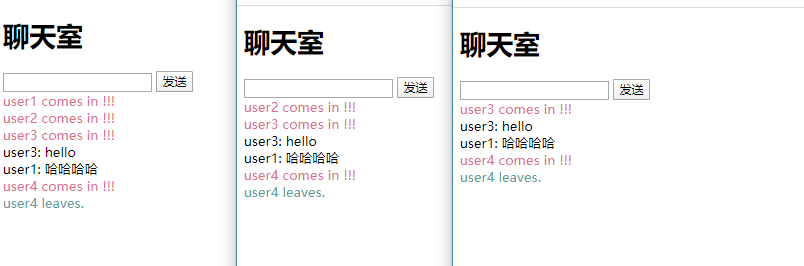

<!-- TOC -->

- [WebSocket](#websocket)
    - [1. 简介](#1-简介)
    - [2. socket.readyState](#2-socketreadystate)
    - [3. 客户端代码](#3-客户端代码)
    - [4. 服务端代码（node)](#4-服务端代码node)
        - [4.1 步骤](#41-步骤)
        - [4.2 功能](#42-功能)
            - [4.2.1 发送数据](#421-发送数据)
            - [4.2.2 多个连接](#422-多个连接)
            - [4.2.3 如何识别某个连接](#423-如何识别某个连接)
    - [5. socket.io](#5-socketio)
        - [5.1 安装](#51-安装)
        - [5.2 建立连接](#52-建立连接)
        - [5.3 向单个客户端发送消息](#53-向单个客户端发送消息)
        - [5.4  向所有客户发送消息](#54--向所有客户发送消息)
        - [5.5 通过on来监听emit事件](#55-通过on来监听emit事件)
        - [5.6 简单使用](#56-简单使用)
        - [](#)
    - [6. 案例](#6-案例)
        - [6.1 聊天室](#61-聊天室)
        - [6.2 通过socket.io改造聊天室](#62-通过socketio改造聊天室)
        - [](#-1)
    - [5. 控制台调试](#5-控制台调试)
    - [socket](#socket)

<!-- /TOC -->
# WebSocket
## 1. 简介
- WebSocket 是 HTML5 开始提供的一种在单个 `TCP` 连接上进行全双工通讯的协议。

- HTTP、WebSocket等均是`应用层协议`，都基于TCP协议来传输数据。可以理解成是对TCP的封装。

- WebSocket 使得客户端和服务器之间的数据交换变得更加简单，允许`服务端主动向客户端推送数据`。

- 在连接和断开之前都要遵循TCP协议的三次握手和四次挥手。

- 对于 WebSocket 来说，它必须**依赖 HTTP 协议进行一次握手**，握手成功后，**数据就直接从 TCP 通道传输，与HTTP无关**

- 为了建立一个 WebSocket 连接，客户端浏览器首先要向服务器发起一个 HTTP 请求，这个请求和通常的 HTTP 请求不同，包含了一些附加头信息，其中附加头信息”**Upgrade: WebSocket**”表 明这是一个申请协议升级的 HTTP 请求，服务器端解析这些附加的头信息然后产生应答信息返回给客户端，客户端和服务器端的 WebSocket 连接就建立起来了，双方就可以通过这个连接通道自由的传递信息，并且这个连接会持续存在直到客户端或者服务器端的某一方主动的关闭连接。

   

## 2. socket.readyState

- 0 : 表示连接尚未建立。
- 1 : 表示连接已建立，可以进行通信。
- 2 : 表示连接正在进行关闭。
- 3 : 表示连接已经关闭或者连接不能打开。


## 3. 客户端代码

```js
//语法 var Socket = new WebSocket(url, [protocol] );
// ws://echo.websocket.org 是 websocket 提供的 server
const ws = new WebSocket('ws://echo.websocket.org')

// 连接建立时触发
ws.onopen = function (e) {
    console.log("Connection open ...");
};

// 接收消息时触发 e.data是客户端从服务器接收到的数据
ws.onmessage = function (e) {
    console.log("Received Message: " + e.data);
    ws.close();
};

// 关闭连接触发
ws.onclose = function (e) {
    console.log("Connection closed.");
};

// 通信发生错误时触发
ws.onerror = function (e) {
    console.log("Connection Error.");
};

// 客户端向服务器发送数据，此数据会在服务器端被接收
ws.send("Hello WebSockets!");

// 检查浏览器是否支持WebSocket
if (typeof WebSocket != 'undefined') {
    alert("您的浏览器支持 WebSocket!");
} else {
    // 浏览器不支持 WebSocket
    alert("您的浏览器不支持 WebSocket!");
}
```

## 4. 服务端代码（node)

### 4.1 步骤

`nodejs` 可以通过`nodejs-websocket`来实现创建一个 websocket 的服务 

1. 安装包：`npm install nodejs-websocket `

2. 新建文件 `wsServer.js `，并启动`node wsServer.js `

   ```js
   // wsServer.js
   var ws = require("nodejs-websocket")
   
   const PORT = 3000
   
   // Scream server example: "hi" -> "HI!!!"
   ws.createServer(function (connection) {
       console.log("New connection")
        connection.on('connect', function (code) {
            console.log('开启连接', code)
        })
        connection.on("text", function (str) {
             // 此为对从客户端接受到的字母进行大写转换
            console.log("Received " + str)
            connection.sendText(str.toUpperCase() + "!!!")
        })
        connection.on('close', function (code) {
            console.log('关闭连接', code)
        })
        connection.on('error', function (code) {
            console.log('异常关闭', code)
        })
   }).listen(PORT, () => {
       console.log('running...');
   })
   ```

3. 在客户端的js代码中修改监听的URL：`ws://echo.websocket.org/`服务为`ws://localhost:3000/`

4. 访问客户端网页，将建立连接

### 4.2 功能

#### 4.2.1 发送数据

```js
connection.sendText()
```

#### 4.2.2 多个连接

当有一个新的用户运行客户端的代码，就会有一个新的连接。所有的连接在 `xxx.connections ` 数组中保存(xxx为连接的名字，如server.connections )

#### 4.2.3 如何识别某个连接

可以在连接中为当前的连接添加属性，如`connection.id = clienCount `，（clienCount为全局变量 在新的连接被建立时累加）


## 5. socket.io

使用socket.io可以用于服务器和客户端建立websocket的连接，API更加方便

使用socket.io时，客户端和服务器端都需要引入socket.io的包

优势：socket.io可以监听自定义事件和发送任意类型的数据

### 5.1 安装

服务器端

```shell
npm install socket.io
```

浏览器端

```html
// sicket.io.js文件需要提前下载
<script src='sicket.io.js'></script>
// CDN地址
<script src="https://cdnjs.cloudflare.com/ajax/libs/socket.io/2.0.3/socket.io.js"></script>
```


### 5.2 建立连接

浏览器与服务器建立连接代码，参数均可省略

```js
const socket = io('服务器地址', {  
    query: `username=参数`
});
```

### 5.3 向单个客户端发送消息

通过emit方法进行消息发送

第一个参数事件名称，第二个参数为发送的数据。

事件名称可自定义，服务器和浏览器发送的数据会在同一时间名的监听中被接收

```js
io.on('connection', (socket) => {
	socket.emit("student", {"roomID":clientRoomID,"textMessage": "hello"});  
})
```

### 5.4  向所有客户发送消息

```js
io.on('connection', (socket) => {
	io.emit('enter', `${socket.nickname} comes in !!!`)
})
```

### 5.5 通过on来监听emit事件

```js
socket.on( 'server',(data)=>{
    console.log(data," 通过监听server事件得到的数据")
}
```


### 5.6 简单使用

服务器代码

```js
const express = require('express');
const http = require('http');
const socketIo = require('socket.io');

const app = express();
const server = http.Server(app);
const io = socketIo(server);

// 监听connection（用户连接）事件，socket为用户连接的实例
io.on('connection', (socket) => {
    console.log("用户" + socket.id + "连接");
    
    // 监听msg事件（这个是自定义的事件）, 参数是从浏览器中接收到的数据
    socket.on('msg', (data) => {
        console.log(data); 
        // 向socket用户发送信息
        socket.emit('msg', '你好浏览器');
        
    })
    
    // 监听用户断开事件
    socket.on('disconnect', () => {
        console.log("用户" + socket.id + "断开连接");
    });
})

server.listen(3000, () => {
    console.log('running...');
});
```

浏览器代码

```html
<script src='sicket.io.js'></script>
<script>
    // 向指定的服务器建立连接，地址可以省略
    const soc = io('http://localhost:3000');
    
    // 自定义msg事件，发送‘你好服务器’字符串向服务器
    soc.emit('msg','你好服务器');
    
    // 监听浏览器通过msg事件发送的信息，data为从服务器端接收的数据
    soc.on('msg',(data)=>{
        console.log(data);
    });
</script>
```

### 


## 6. 案例

### 6.1 聊天室

实现如下图所示的聊天室功能。

- 用户进入所有用户会显示 ××× comes in ！
- 用户发送数据时，所有的用户都会收到此条消息
- 用户离开时，所有的用户都会收到 ××× leaves .



```js
//wsServer.js
var ws = require("nodejs-websocket")

const PORT = 3000
let clientCount = 0

const server = ws.createServer(function (connection) {
    console.log("New connection")
    clientCount++
    connection.nickname = "user" + clientCount
    broadcast(0, connection.nickname + ' comes in !!!')
    
    connection.on("text", function (str) {
        broadcast(1, connection.nickname + ": " + str)
    })
    connection.on('close', function (code) {
        broadcast(2, connection.nickname + " leaves.")
    })
    connection.on('error', function (code) {
        console.log('异常关闭', code)
    })
}).listen(PORT, () => {
    console.log('running...');
})

function broadcast(type, info) {
    let mes = {}
    mes.type = type
    mes.info = info
    server.connections.forEach(connection => {
        connection.sendText(JSON.stringify(mes))
    })
}
```

```html
<!-- index.html -->
<!DOCTYPE html>
<html lang="en">

<head>
    <meta charset="UTF-8">
    <meta name="viewport" content="width=device-width, initial-scale=1.0">
    <meta http-equiv="X-UA-Compatible" content="ie=edge">
    <title>Document</title>
</head>

<body>
    <h1>聊天室</h1>
    <input type="text" id="lmz_sendText">
    <button id="lmz_sendBtn">发送</button>
    <div id="chatBox"></div>
</body>
<script>
    let input = document.getElementById('lmz_sendText')
    let btn = document.getElementById('lmz_sendBtn')
    let chatBox = document.getElementById('chatBox')

    function showMessage(type, elem, str) {
        let div = document.createElement('div')
        let colors = ['palevioletred','black', 'cadetblue']
        div.style.color = colors[type]
        div.innerHTML = str
        elem.appendChild(div)
    }

    const ws = new WebSocket('ws://localhost:3000')
    ws.onopen = function (e) {
        console.log("connection open...")
        btn.onclick = function () {
            ws.send(input.value)
        }
    }
    ws.onclose = function (e) {
        console.log("connection close!");
    }
    ws.onmessage = function (e) {
        let mes = JSON.parse(e.data)
        showMessage(mes.type, chatBox, mes.info)
        
    }
</script>

</html>
```

### 6.2 通过socket.io改造聊天室

wsServer.js

```js
const express = require('express');
const http = require('http');
const socketIo = require('socket.io');

const app = express();
const server = http.Server(app);
const io = socketIo(server);

let clientCount = 0
// 监听connection（用户连接）事件，socket为用户连接的实例
io.on('connection', (socket) => {
    clientCount++
    socket.nickname = `user${clientCount}`
    io.emit('enter', `${socket.nickname} comes in !!!`)

    socket.on('message', (str) => {
        io.emit('message', `${socket.nickname}: ${str}`)
    })

    // 监听用户断开事件
    socket.on('disconnect', () => {
        io.emit('leave', `${socket.nickname} leaves.`)
    });
})

server.listen(3000, () => {
    console.log('running...');
});
```

 index.html

```js
<!DOCTYPE html>
<html lang="en">

<head>
    <meta charset="UTF-8">
    <meta name="viewport" content="width=device-width, initial-scale=1.0">
    <meta http-equiv="X-UA-Compatible" content="ie=edge">
    <title>Document</title>
    <style>
    </style>
</head>

<body>
    <h1>聊天室</h1>
    <input type="text" id="lmz_sendText">
    <button id="lmz_sendBtn">发送</button>
    <div id="chatBox"></div>
</body>
<script src="https://cdnjs.cloudflare.com/ajax/libs/socket.io/2.0.3/socket.io.js"></script>

<script>
    let input = document.getElementById('lmz_sendText')
    let btn = document.getElementById('lmz_sendBtn')
    let chatBox = document.getElementById('chatBox')

    const soc = io('http://localhost:3000');

    // 用户进入
    soc.on('enter', (str) => {
        showMessage(0, chatBox, str)
    });

    // 用户通信
    soc.on('message', (str) => {
        showMessage(1, chatBox, str)
    });

    // 用户离开
    soc.on('leave', (str) => {
        showMessage(2, chatBox, str)
    });

	// 发送消息
    btn.onclick = function () {
        soc.emit('message', input.value)
        input.value = ''
    }

    function showMessage(type, elem, str) {
        let div = document.createElement('div')
        let colors = ['palevioletred', 'black', 'cadetblue']
        div.style.color = colors[type]
        div.innerHTML = str
        elem.appendChild(div)
    }
</script>

</html>
```


### 

## 5. 控制台调试

在Network中可以看到websocket的连接请求，同时在Messages中可以看到发送和接收的数据

## socket

socket并不是一个协议，它工作在OSI模型会话层（第5层），是为了方便大家直接使用更底层协议（TCP/UDP）而存在的一个抽象层。它是一组接口。它把负载的TCP/IP协议隐藏在Socket解耦后面，对用户来说，一组简单的接口就是全部，让socket去组织数据，以符合指定的协议


